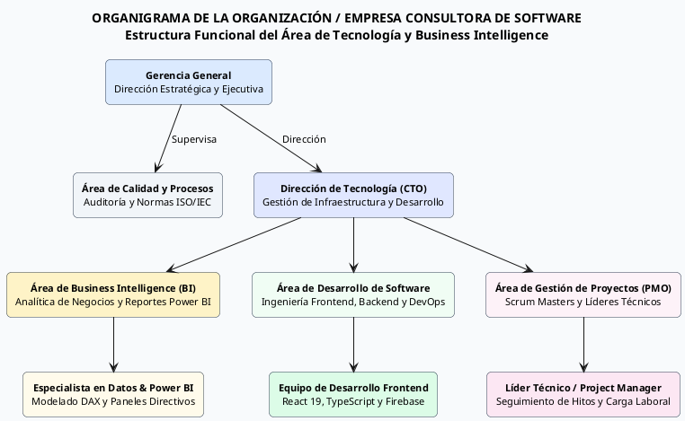
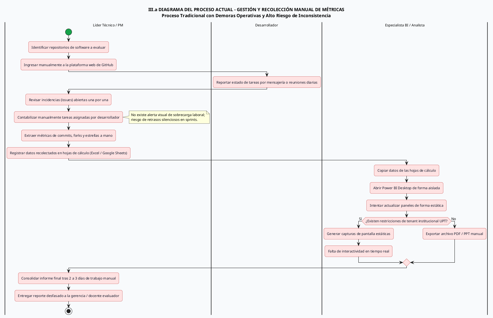
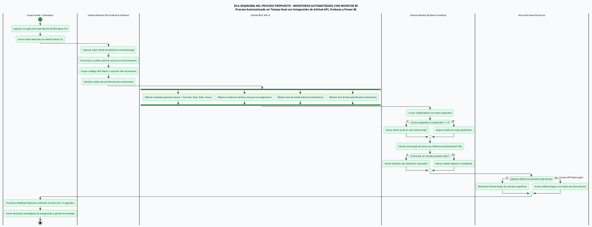
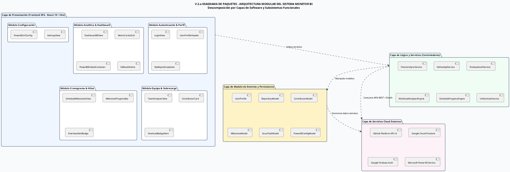
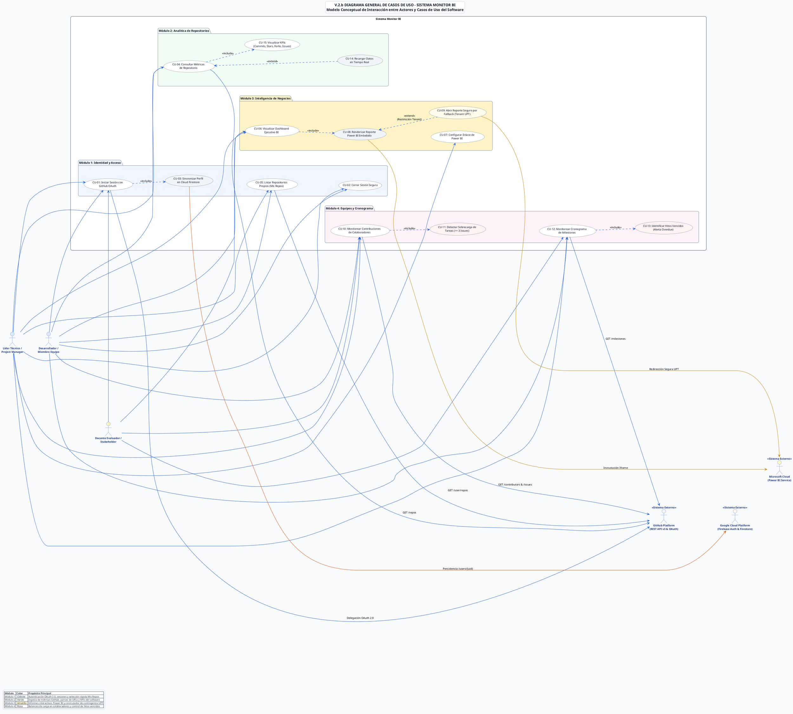
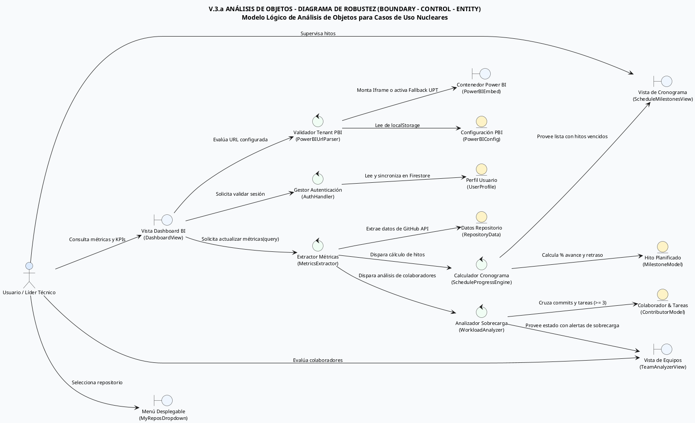
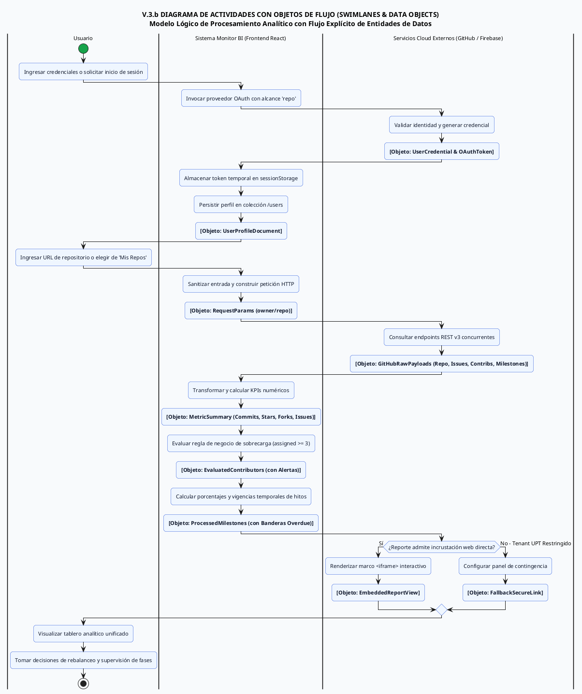
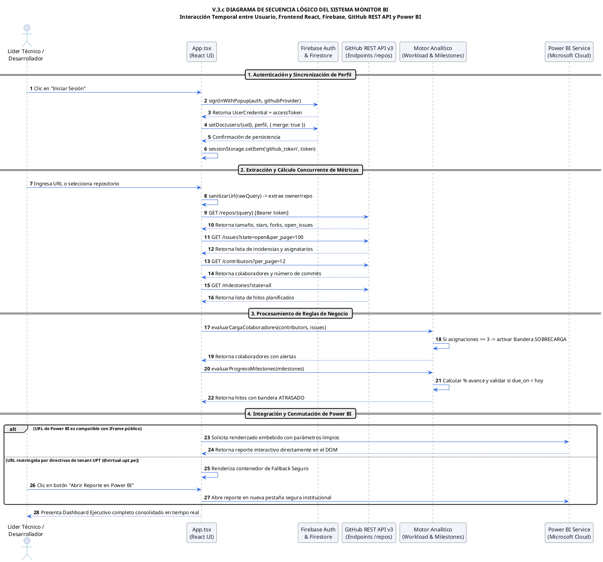
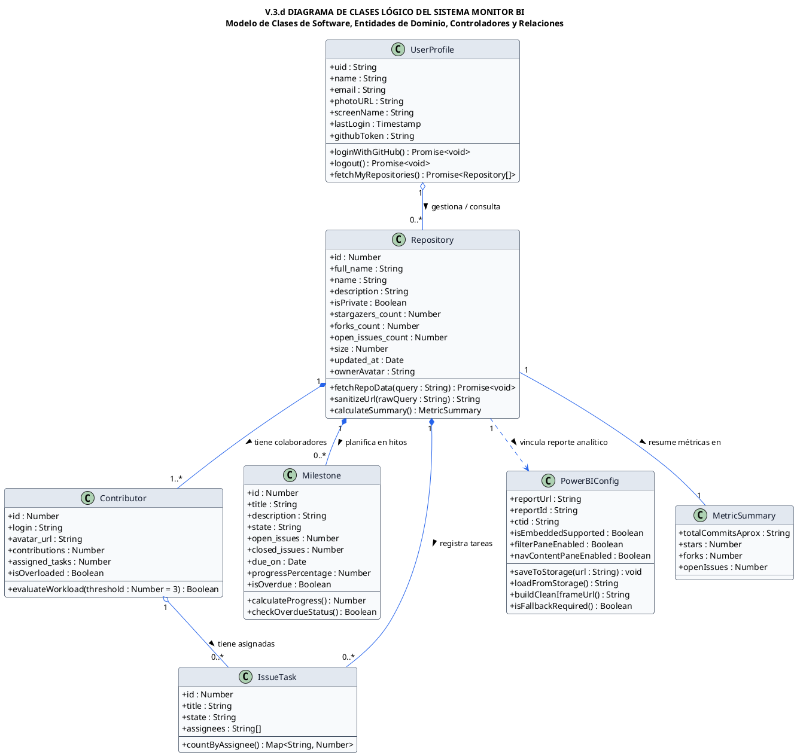

# **UNIVERSIDAD PRIVADA DE TACNA**
## **FACULTAD DE INGENIERÍA**
### **Escuela Profesional de Ingeniería de Sistemas**

---

### **DOCUMENTO DE ESPECIFICACIÓN DE REQUERIMIENTOS DE SOFTWARE (SRS / ERS)**
**Código Documental: FD03-EPIS | Versión 1.0**

---

### **Proyecto:**
# **MONITOR DE MÉTRICAS BI:**
### **SISTEMA INTELIGENTE DE ANALÍTICA DE REPOSITORIOS GITHUB, GESTIÓN DE EQUIPOS Y TOMA DE DECISIONES EMPRESARIALES**

**Curso:** Inteligencia de Negocios (SI-885) — Semestre 2026-II  
**Docente:** Mag. Patrick José Cuadros Quiroga  
**Grupo de Desarrollo:** Grupo N° 4  

**Integrantes:**
- **Colque Quispe, Rodrigo Sídney** (Código: 2023077078)
- **Ramos, Fabricio** (Código: 2023076798)

**Tacna – Perú**  
**2026**

\pagebreak

---

# CONTROL DE VERSIONES

### Tabla 1
*Historial de Revisiones y Control de Versiones del Documento FD03*

| Versión | Hecha por | Revisada por | Aprobada por | Fecha | Motivo |
| :---: | :--- | :--- | :--- | :---: | :--- |
| **0.1** | R. Colque / F. Ramos | Mag. P. Cuadros | Comité EPIS | 15/09/2026 | Estructuración inicial de requerimientos funcionales, arquitectura conceptual y objetivos de negocio. |
| **1.0** | R. Colque / F. Ramos | Mag. P. Cuadros | Escuela EPIS | 06/10/2026 | Versión formal completa bajo estándares IEEE Std 830-1998, ISO/IEC/IEEE 29148:2018 y Formato APA 7ma Edición. |

*Nota.* Control de cambios institucional formalizado conforme a la normativa académica y rúbrica de evaluación de la Escuela Profesional de Ingeniería de Sistemas (EPIS UPT).

\pagebreak

---

# ÍNDICE GENERAL

- [INTRODUCCIÓN](#introducción) ............................................................................................................ 4
- [I. Generalidades de la Empresa](#i-generalidades-de-la-empresa) ............................................................................ 5
  - [1. Nombre de la Empresa](#1-nombre-de-la-empresa) ................................................................................ 5
  - [2. Visión](#2-visión) ................................................................................................................ 5
  - [3. Misión](#3-misión) ................................................................................................................ 5
  - [4. Organigrama](#4-organigrama) .................................................................................................... 5
- [II. Visionamiento de la Empresa](#ii-visionamiento-de-la-empresa) .......................................................................... 5
  - [1. Descripción del Problema](#1-descripción-del-problema) ........................................................................ 5
  - [2. Objetivos de Negocios](#2-objetivos-de-negocios) ................................................................................ 5
  - [3. Objetivos de Diseño](#3-objetivos-de-diseño) .................................................................................... 5
  - [4. Alcance del proyecto](#4-alcance-del-proyecto) .................................................................................... 5
  - [5. Viabilidad del Sistema](#5-viabilidad-del-sistema) ................................................................................ 5
  - [6. Información obtenida del Levantamiento de Información](#6-información-obtenida-del-levantamiento-de-información) ............ 6
- [III. Análisis de Procesos](#iii-análisis-de-procesos) ...................................................................................... 6
  - [a) Diagrama del Proceso Actual – Diagrama de actividades](#a-diagrama-del-proceso-actual--diagrama-de-actividades) .................... 6
  - [b) Diagrama del Proceso Propuesto – Diagrama de actividades Inicial](#b-diagrama-del-proceso-propuesto--diagrama-de-actividades-inicial) 7
- [IV. Especificación de Requerimientos de Software](#iv-especificación-de-requerimientos-de-software) ...................................... 7
  - [a) Cuadro de Requerimientos funcionales Inicial](#a-cuadro-de-requerimientos-funcionales-inicial) .................................... 7
  - [b) Cuadro de Requerimientos No funcionales](#b-cuadro-de-requerimientos-no-funcionales) ............................................ 7
  - [c) Cuadro de Requerimientos funcionales Final](#c-cuadro-de-requerimientos-funcionales-final) ........................................ 8
  - [d) Reglas de Negocio](#d-reglas-de-negocio) ........................................................................................ 9
- [V. Fase de Desarrollo](#v-fase-de-desarrollo) .............................................................................................. 12
  - [1. Perfiles de Usuario](#1-perfiles-de-usuario) .................................................................................... 12
  - [2. Modelo Conceptual](#2-modelo-conceptual) ........................................................................................ 12
    - [a) Diagrama de Paquetes](#a-diagrama-de-paquetes) ................................................................................ 12
    - [b) Diagrama de Casos de Uso](#b-diagrama-de-casos-de-uso) ........................................................................ 14
    - [c) Escenarios de Caso de Uso (narrativa)](#c-escenarios-de-caso-de-uso-narrativa) ................................................ 16
  - [3. Modelo Lógico](#3-modelo-lógico) ................................................................................................ 23
    - [a) Análisis de Objetos](#a-análisis-de-objetos) .................................................................................... 23
    - [b) Diagrama de Actividades con objetos](#b-diagrama-de-actividades-con-objetos) .................................................... 26
    - [c) Diagrama de Secuencia](#c-diagrama-de-secuencia) ................................................................................ 29
    - [d) Diagrama de Clases](#d-diagrama-de-clases) .................................................................................... 33
- [CONCLUSIONES](#conclusiones) ................................................................................................................ 46
- [RECOMENDACIONES](#recomendaciones) ............................................................................................................ 46
- [BIBLIOGRAFÍA](#bibliografía) ................................................................................................................ 46
- [WEBGRAFÍA](#webgrafía) ...................................................................................................................... 48

---

# ÍNDICE DE TABLAS

- **Tabla 1:** Historial de Revisiones y Control de Versiones del Documento FD03
- **Tabla 2:** Matriz de Personal y Responsabilidades Organizacionales de DevMetrics Analytics S.A.C.
- **Tabla 3:** Matriz de Evaluación de Viabilidad Multidimensional del Sistema Monitor BI
- **Tabla 4:** Resultados Estadísticos del Levantamiento de Información (Muestra n = 35)
- **Tabla 5:** Cuadro de Requerimientos Funcionales Inicial (RF-01 a RF-15)
- **Tabla 6:** Cuadro de Requerimientos No Funcionales según la Norma ISO/IEC 25010:2011
- **Tabla 7:** Matriz de Priorización MoSCoW para Requerimientos Funcionales
- **Tabla 8:** Cuadro de Requerimientos Funcionales Final con Criterios de Aceptación Verificables
- **Tabla 9:** Catálogo de Reglas de Negocio Institucionales y Algorítmicas (RN-01 a RN-10)
- **Tabla 10:** Matriz de Perfiles de Usuario y Privilegios del Sistema
- **Tabla 11:** Inventario de Casos de Uso del Sistema Monitor BI (CU-01 a CU-12)
- **Tabla 12:** Especificación Narrativa del Caso de Uso CU-01: Autenticación Federada con GitHub OAuth 2.0
- **Tabla 13:** Especificación Narrativa del Caso de Uso CU-03: Consulta y Extracción de Métricas de Repositorio
- **Tabla 14:** Especificación Narrativa del Caso de Uso CU-06: Detección y Notificación de Sobrecarga de Colaboradores
- **Tabla 15:** Especificación Narrativa del Caso de Uso CU-07: Supervisión y Alerta de Hitos Vencidos
- **Tabla 16:** Especificación Narrativa del Caso de Uso CU-10 / CU-11: Visualización y Fallback de Reporte Power BI
- **Tabla 17:** Catálogo de Clasificación de Objetos del Análisis de Robustez (Boundary - Control - Entity)
- **Tabla 18:** Especificación Detallada de Clases, Atributos y Operaciones del Modelo Lógico

---

# ÍNDICE DE FIGURAS (MODELOS PLANTUML)

- **Figura 1:** Estructura Orgánica y Funcional de la Empresa DevMetrics Analytics S.A.C. (`01_organigrama_empresa.puml`)
- **Figura 2:** Diagrama de Actividades del Proceso Actual – Recolección Manual y Reporte Tradicional (`02_proceso_actual_actividades.puml`)
- **Figura 3:** Diagrama de Actividades del Proceso Propuesto – Monitoreo Automatizado en Tiempo Real (`03_proceso_propuesto_actividades.puml`)
- **Figura 4:** Diagrama de Paquetes – Arquitectura Modular por Capas del Sistema Monitor BI (`04_diagrama_paquetes.puml`)
- **Figura 5:** Diagrama General de Casos de Uso del Sistema Monitor BI (`05_diagrama_casos_de_uso.puml`)
- **Figura 6:** Diagrama de Robustez (BCE) – Análisis Lógico de Objetos para Procesamiento Analítico (`06_analisis_objetos_robustez.puml`)
- **Figura 7:** Diagrama de Actividades con Objetos de Datos y Swimlanes Organizacionales (`07_actividades_con_objetos.puml`)
- **Figura 8:** Diagrama de Secuencia Lógico Integral del Sistema Monitor BI (`08_diagramas_secuencia.puml`)
- **Figura 9:** Diagrama de Clases del Dominio y Modelo Lógico de Datos (`09_diagrama_clases.puml`)

\pagebreak

---

# INTRODUCCIÓN

En la era contemporánea de la ingeniería de software y la transformación digital empresarial, la gestión eficiente del desarrollo de aplicaciones demanda capacidades analíticas avanzadas que trasciendan la simple inspección visual del código fuente. De acuerdo con Pressman y Maxim (2020), la observabilidad cuantitativa de los procesos de desarrollo constituye una condición indispensable para asegurar la calidad de los artefactos informáticos, optimizar el rendimiento de los equipos de trabajo y mitigar de forma temprana los riesgos asociados a desvíos presupuestarios y demoras en el cronograma. Dentro de este contexto, la **Inteligencia de Negocios (Business Intelligence - BI)** se ha consolidado como una disciplina estratégica fundamental, capaz de transformar grandes volúmenes de datos transaccionales dispersos en repositorios de código colaborativo en indicadores clave de rendimiento (Key Performance Indicators - KPIs) accionables para la alta dirección y los líderes técnicos de proyectos (Ferrari & Russo, 2020; Kim et al., 2016).

En el ámbito académico y profesional de la **Escuela Profesional de Ingeniería de Sistemas (EPIS)** de la **Universidad Privada de Tacna (UPT)**, los equipos de desarrollo inscritos en la asignatura de **Inteligencia de Negocios (SI-885)** ejecutan proyectos de software de envergadura utilizando la plataforma distribuida **GitHub** como núcleo de control de versiones y gestión de incidencias. Sin embargo, el seguimiento tradicional del progreso de dichos proyectos ha dependido históricamente de auditorías manuales, revisiones episódicas de tareas y consolidación de reportes estáticos en hojas de cálculo electrónicas (Microsoft Excel). Dicho procedimiento manual genera una latencia temporal considerable (de 48 a 72 horas por ciclo evaluativo), induce errores humanos de transcripción y propicia una marcada ceguera operativa respecto a la distribución de la carga laboral individual, lo cual desencadena sobrecarga laboral inadvertida y retrasos críticos en la consecución de los hitos planificados (Sommerville, 2016).

El presente documento formaliza la **Especificación de Requerimientos de Software (SRS / ERS - Código Documental FD03-EPIS)** para el proyecto denominado **MONITOR DE MÉTRICAS BI: SISTEMA INTELIGENTE DE ANALÍTICA DE REPOSITORIOS GITHUB, GESTIÓN DE EQUIPOS Y TOMA DE DECISIONES EMPRESARIALES**. Este sistema ha sido concebido y modelado por el **Grupo N° 4** bajo las directrices del docente **Mag. Patrick José Cuadros Quiroga**, integrando tecnologías modernas de computación en la nube y desarrollo web reactivo: una arquitectura Single Page Application (SPA) basada en **React 19** con compilación de alto rendimiento sobre **Vite**, autenticación federada y almacenamiento no relacional serverless provistos por **Google Cloud Firebase (Firebase Auth v12 y Cloud Firestore)**, consumo automatizado de la **API REST v3 de GitHub**, y visualización interactiva de tableros directivos mediante **Microsoft Power BI Service**.

El diseño del sistema responde con rigor a las directivas metodológicas de la ingeniería de requisitos delineadas en el estándar **IEEE Std 830-1998** (*Recommended Practice for Software Requirements Specifications*) y la norma internacional **ISO/IEC/IEEE 29148:2018** (*Systems and software engineering — Life cycle processes — Requirements engineering*). Asimismo, la calidad del producto y sus atributos no funcionales han sido formulados bajo la taxonomía de la norma **ISO/IEC 25010:2011**, garantizando que la solución satisfaga estándares rigurosos de eficiencia de desempeño, seguridad informática, usabilidad, fiabilidad y mantenibilidad (ISO/IEC, 2011). 

Una innovación arquitectónica crítica introducida en el sistema radica en el diseño de un mecanismo de **Fallback Seguro y Tolerante a Fallos para Microsoft Power BI**. Dicho componente solventa de forma algorítmica las restricciones de incrustación de iframes impuestas por las directivas de seguridad del tenant institucional universitario de la Universidad Privada de Tacna (`@virtual.upt.pe`), garantizando que los evaluadores y líderes de proyecto mantengan un acceso ininterrumpido a los paneles analíticos sin verse limitados por políticas de tenant cruzado o denegaciones de encabezados HTTP (*X-Frame-Options* o *Content-Security-Policy*) (Microsoft Corporation, 2024). A través de esta especificación técnica, se define la línea base de desarrollo y verificación que guiará la fase de construcción e implantación de la solución analítica.

\pagebreak

---

# I. Generalidades de la Empresa

## 1. Nombre de la Empresa

La empresa promotora y ejecutora del presente proyecto de innovación tecnológica es **DevMetrics Analytics S.A.C.**, constituida como una entidad consultora de software y análisis avanzado de datos nacida bajo la incubación académica y tecnológica del Departamento de Innovación de la Escuela Profesional de Ingeniería de Sistemas de la Universidad Privada de Tacna.

- **Razón Social:** DevMetrics Analytics Sociedad Anónima Cerrada (DevMetrics Analytics S.A.C.)
- **Nombre Comercial:** DevMetrics BI Solutions
- **Registro Único de Contribuyentes (RUC Ficticio de Referencia Académica):** 20608945123
- **Actividad Económica Principal (CIIU 6201):** Actividades de programación informática, consultoría de tecnologías de la información, análisis de inteligencia de negocios y servicios de observabilidad de procesos de software.
- **Domicilio Fiscal Institucional:** Av. Jorge Basadre Grohmann s/n, Campus Capanique, Facultad de Ingeniería, Pabellón de Ingeniería de Sistemas, Tacna, Perú.

DevMetrics Analytics S.A.C. opera bajo un modelo de consultoría tecnológica enfocado en la provisión de soluciones SaaS (Software as a Service) orientadas a la optimización de procesos de ingeniería en empresas de base tecnológica, factorías de software y centros de investigación universitaria.

## 2. Visión

"Consolidarse hacia el año 2030 como la empresa consultora referente a nivel de la macrorregión sur del Perú y en el ámbito latinoamericano en soluciones de inteligencia de negocios, observabilidad analítica y analítica de repositorios de software, reconocida por su excelencia arquitectónica, la aplicación rigurosa de estándares internacionales de ingeniería y la innovación en plataformas cloud-native capaces de potenciar la toma de decisiones estratégicas en equipos de desarrollo de software de alta exigencia."

## 3. Misión

"Proveer a las organizaciones desarrolladoras de software, líderes técnicos y evaluadores institucionales soluciones tecnológicas de Business Intelligence y monitoreo en tiempo real altamente confiables, intuitivas y resilientes, que transformen los datos brutos de la actividad de desarrollo en repositorios colaborativos en conocimiento analítico accionable. Mediante la automatización de la ingesta de métricas, el balanceo algorítmico de la carga de trabajo y el seguimiento transparente de hitos, DevMetrics Analytics busca maximizar la productividad, mitigar el agotamiento laboral de los desarrolladores y elevar de forma continua los estándares de calidad en las entregas de software."

## 4. Organigrama

La estructura organizacional de DevMetrics Analytics S.A.C. responde a un modelo jerárquico-funcional optimizado para empresas de tecnología ágiles, asegurando una separación clara de responsabilidades operativas, estratégicas y de control de calidad. Dicha organización se encuentra encabezada por la Gerencia General, respaldada por un Área de Calidad y Procesos independiente, y articulada operativamente por la Dirección de Tecnología (CTO), de la cual dependen las tres unidades ejecutoras clave: Business Intelligence (BI), Desarrollo de Software y la Oficina de Gestión de Proyectos (PMO).

A continuación, se presenta la especificación formal del modelo estructural mediante código declarativo PlantUML.

### Código Fuente del Modelo Visual (PlantUML)

### Figura 1
*Estructura Orgánica y Funcional de la Empresa DevMetrics Analytics S.A.C.*

*Nota.* Modelado visual desarrollado en sintaxis PlantUML bajo estándar institucional de la EPIS UPT. Archivo fuente: `diagrams/01_organigrama_empresa.puml`.

### Tabla 2
*Matriz de Personal y Responsabilidades Organizacionales de DevMetrics Analytics S.A.C.*

| Órgano / Puesto | Área Organizacional | Responsabilidades Principales | Grado de Interacción con el Sistema |
| :--- | :--- | :--- | :---: |
| **Gerente General** | Dirección Ejecutiva | Dirección estratégica de la consultora, aprobación de convenios institucionales y revisión de informes ejecutivos de alto nivel. | Supervisor Estratégico |
| **Auditor de Calidad y Procesos** | Calidad y Procesos (QA) | Auditoría del cumplimiento de estándares de software (IEEE 830, ISO 29148, ISO 25010), revisión de normativas APA 7 y validación de entregables. | Revisor de Estándares |
| **Director de Tecnología (CTO)** | Tecnología e Innovación | Definición del stack tecnológico, diseño de la arquitectura cloud en Google Cloud Firebase y supervisión técnica global. | Arquitecto Principal |
| **Especialista en Datos & Power BI** | Business Intelligence (BI) | Modelado analítico dimensional (esquema estrella), formulación de métricas DAX, diseño de tableros interactivos y gestión del servicio Power BI. | Diseñador Analítico |
| **Líder Frontend (React 19)** | Desarrollo de Software | Implementación de componentes reactivos en React 19, integración de SDK Firebase Auth v12, consumo de GitHub REST API y control de estados. | Desarrollador Núcleo |
| **Líder Técnico / Project Manager** | Gestión de Proyectos (PMO) | Monitoreo del cronograma, asignación de tareas a colaboradores, balanceo de sobrecarga operativa y evaluación de entregas de sprints. | Usuario Operativo Clave |

*Nota.* Estructura adaptada para satisfacer las exigencias del ciclo de vida ágil y la observabilidad de proyectos de software en la asignatura SI-885 (EPIS UPT, 2026).

\pagebreak

---

# II. Visionamiento de la Empresa

## 1. Descripción del Problema

En las actividades modernas de ingeniería de software, el ciclo de vida del desarrollo se fundamenta en la interacción continua sobre sistemas de control de versiones distribuidos, entre los cuales GitHub ostenta la mayor cuota de adopción industrial y académica (Chacon & Straub, 2014). Durante el desarrollo de software colaborativo en la EPIS UPT y en empresas del sector, múltiples desarrolladores realizan commits, abren incidencias (issues), gestionan pull requests y definen hitos temporales (milestones). Sin embargo, la gestión, supervisión y evaluación de estos flujos adolece de graves deficiencias estructurales:

1. **Recolección Manual y Dispersión de Información:** Los líderes de proyecto, docentes y evaluadores técnicos deben acceder de forma individual a múltiples vistas web de GitHub, navegar por pestañas desconectadas y registrar datos a mano en hojas de cálculo electrónicas (Microsoft Excel). Este procedimiento artesanal insume entre 48 y 72 horas por ciclo evaluativo, induciendo una alta tasa de error humano en la transcripción de métricas (Sommerville, 2016).
2. **Ceguera Operativa ante la Sobrecarga Laboral:** La plataforma estándar de GitHub carece de un sistema de alerta visual que identifique la concentración desmedida de incidencias críticas en determinados desarrolladores. Como consecuencia, ciertos miembros acumulan tres o más tareas de alta complejidad en forma simultánea, desencadenando agotamiento mental (burnout), cuellos de botella en la integración continua y retrasos no anticipados en los sprints (Kim et al., 2016).
3. **Invisibilidad del Ritmo de Cumplimiento de Hitos (Milestones):** Los hitos temporales suelen vencer sin que el equipo directivo reciba una notificación proactiva o una señalización visual destacada. Las herramientas estándar no proporcionan un cálculo dinámico inmediato del porcentaje de avance ponderado en una única vista consolidada junto a las métricas del repositorio.
4. **Incompatibilidad y Bloqueos de Seguridad en Power BI:** Microsoft Power BI es el estándar corporativo para la analítica directiva; no obstante, cuando los reportes son generados dentro del tenant educativo institucional de la Universidad Privada de Tacna (`@virtual.upt.pe`), las políticas de seguridad de la organización restringen la publicación web pública abierta (`Publish to Web`). Al intentar embeber dichos reportes mediante etiquetas `<iframe>` estándar en aplicaciones web de terceros, los navegadores bloquean el contenido por directivas CORS, `X-Frame-Options: SAMEORIGIN` o denegaciones de autenticación de tenant cruzado. La ausencia de un mecanismo de fallback estructurado provoca que los tableros analíticos queden inutilizables durante sesiones de revisión gerencial o docente.

## 2. Objetivos de Negocios

Para resolver de manera definitiva las problemáticas diagnosticadas, DevMetrics Analytics S.A.C. formula los siguientes objetivos de negocio, articulados bajo el enfoque SMART (Específicos, Medibles, Alcanzables, Relevantes y Temporales):

### Objetivo General de Negocios
Desarrollar, desplegar y validar operativamente el sistema **Monitor de Métricas BI**, centralizando la ingesta de datos de repositorios GitHub, el análisis de sobrecarga de personal y la visualización de tableros de Microsoft Power BI en una interfaz web reactiva unificada para optimizar en un 90% la toma de decisiones directivas y la supervisión ágil de proyectos en la EPIS UPT durante el semestre 2026-II.

### Objetivos Específicos de Negocios
1. **Reducción Radical del Tiempo de Auditoría:** Disminuir el tiempo de extracción, consolidación y presentación de indicadores de repositorio de 48 horas a menos de 1.5 segundos mediante consumo automatizado de la API REST v3 de GitHub.
2. **Prevención Algorítmica del Burnout y Balanceo de Carga:** Identificar con 100% de precisión visual inmediata a cualquier miembro del equipo que mantenga asignadas tres (3) o más incidencias abiertas simultáneas mediante un distintivo de sobrecarga de color rojo de alta visibilidad.
3. **Garantía de Acceso Analítico Resiliente:** Lograr una disponibilidad del 100% en la visualización de métricas de Power BI, implementando un mecanismo de contingencia (Fallback Seguro) que active un acceso alternativo con un solo clic cuando se detecten bloqueos originados por las directivas del tenant institucional `@virtual.upt.pe`.
4. **Seguimiento Cronológico Proactivo:** Supervisar el ciclo de vida de los hitos planificados, calculando dinámicamente el porcentaje de avance $((text{closed} / text{total}) 	imes 100)$ y alertando con un rótulo crítico cuando la fecha límite (`due_on`) se encuentre vencida respecto a la fecha actual del sistema.
5. **Auditoría Centralizada de Usuarios:** Registrar y actualizar de manera no destructiva en Google Cloud Firestore los perfiles de todos los usuarios que inicien sesión federada con credenciales GitHub OAuth 2.0.

## 3. Objetivos de Diseño

El diseño de la solución de software se rige por los siguientes preceptos de arquitectura moderna (Bass et al., 2021; Pressman & Maxim, 2020):

1. **Arquitectura Reactiva Single Page Application (SPA):** Utilizar React 19 sobre Vite para garantizar una carga instantánea, componentes modulares puros, soporte de Hooks modernos y eliminación de recargas de página completas.
2. **Separación de Responsabilidades y Bajo Acoplamiento:** Estructurar el código en capas independientes (Presentación, Controladores/Lógica de Negocio, Dominio y Persistencia, y Adaptadores Cloud), asegurando que cambios en la API de GitHub o en Power BI no afecten la estabilidad de la interfaz gráfica.
3. **Experiencia de Usuario (UX) Ejecutiva y Accesible:** Diseñar una interfaz limpia, sin elementos visuales superfluos, que presente tarjetas de métricas claras, indicadores de progreso con código cromático intuitivo (Verde: Normal, Ámbar: Precaución, Rojo: Sobrecarga/Vencido) y tipografía de grado corporativo.
4. **Manejo Seguro de Secretos y Tokens Volátiles:** Aislar los tokens de acceso OAuth en almacenamiento de sesión (`sessionStorage`), impidiendo su exposición en almacenamiento local permanente (`localStorage`) o en repositorios de código público.
5. **Tolerancia a Fallos y Degradación Elegante:** Dotar al sistema de manejadores de excepciones que capturen errores HTTP 403 (Rate Limit Exceeded de GitHub), URLs mal formadas y restricciones de iframes, proveyendo mensajes de retroalimentación orientativos al usuario final.

## 4. Alcance del proyecto

El alcance del proyecto delimita con precisión las capacidades funcionales provistas por el sistema y los límites operativos acordados con los interesados:

### Capacidades Incluidas en el Alcance (In Scope)
- Autenticación federada de usuarios mediante GitHub OAuth 2.0 y el SDK Firebase Auth v12 con apertura de ventana emergente (*popup*).
- Sincronización y persistencia de perfiles de usuario en la colección `/users` de Google Cloud Firestore con preservación de marcas de tiempo (*timestamps*).
- Módulo selector "Mis Repos" que consulta dinámicamente los repositorios pertenecientes al usuario autenticado.
- Extracción de datos en tiempo real de cualquier repositorio público o privado con acceso autorizado mediante la GitHub REST API v3: Commits (estimados por tamaño y actividad), Estrellas (*stargazers*), Bifurcaciones (*forks*) e Incidencias Abiertas (*open issues*).
- Sanitización algorítmica de cadenas de búsqueda para aceptar indistintamente formatos URL completos (`https://github.com/owner/repo`) o identificadores cortos (`owner/repo`).
- Análisis y balanceo de carga de colaboradores cruzando la lista de contribuyentes con las incidencias abiertas asignadas.
- Monitoreo cronológico de hitos (*milestones*) con cálculo porcentual de avance y alertas de vencimiento por fecha.
- Módulo de incrustación de reportes Microsoft Power BI con configuración dinámica de URL de publicación web y aplicación de parámetros de interfaz limpia (`filterPaneEnabled=false`, `navContentPaneEnabled=false`).
- Mecanismo de Fallback Seguro para Power BI activado ante bloqueos de políticas de tenant institucional universitario.

### Límites y Exclusiones del Alcance (Out of Scope)
- El sistema no modificará, creará ni eliminará código fuente, ramas (*branches*) ni configuraciones en los repositorios remotos de GitHub (operación estrictamente de sólo lectura).
- El sistema no procesará facturación ni adquisición de licencias comerciales de GitHub Enterprise o Microsoft Power BI Pro.
- No se incluye análisis estático profundo de código fuente a nivel de árboles de sintaxis abstracta (AST) o detección de vulnerabilidades tipo SonarQube.
- No se contempla el soporte para repositorios locales que no se encuentren sincronizados con la nube pública de GitHub.

## 5. Viabilidad del Sistema

Para fundamentar la viabilidad de la inversión tecnológica y el esfuerzo de ingeniería, se evaluaron seis dimensiones de factibilidad conforme a los estándares de la Escuela Profesional de Ingeniería de Sistemas (EPIS UPT, 2026).

### Tabla 3
*Matriz de Evaluación de Viabilidad Multidimensional del Sistema Monitor BI*

| Dimensión de Viabilidad | Análisis de Factibilidad y Fundamento Técnico | Calificación |
| :--- | :--- | :---: |
| **Viabilidad Técnica** | El equipo domina el ecosistema React 19, TypeScript, Google Cloud Firestore y la API de GitHub. Los servicios cloud seleccionados cuentan con 99.9% de SLA y documentación exhaustiva. | **Altamente Viable** |
| **Viabilidad Económica** | El proyecto aprovecha el nivel gratuito (*Spark Plan*) de Google Cloud Firebase y el consumo de GitHub API bajo tokens personales. Costo de infraestructura durante la fase operativa inicial: $0.00 USD/mes. Retorno de inversión inmediato por ahorro de horas-hombre. | **Altamente Viable** |
| **Viabilidad Operativa** | La adopción por parte de docentes y líderes técnicos es inmediata: inicio de sesión en 1 clic con credenciales GitHub preexistentes, sin curvas de aprendizaje complejas ni configuraciones locales de servidores. | **Altamente Viable** |
| **Viabilidad Legal** | Cumplimiento estricto de la Ley N° 29733 (Ley de Protección de Datos Personales del Perú). No se almacenan contraseñas ni datos sensibles de tarjetas. Uso legítimo de APIs bajo términos de servicio de GitHub y Microsoft. Licencia de código abierto MIT con fines educativos. | **Viable y Conforme** |
| **Viabilidad Social** | Fomenta la transparencia, el trabajo colaborativo equitativo y previene activamente el agotamiento laboral de estudiantes y profesionales al visibilizar la sobrecarga de tareas. | **Altamente Viable** |
| **Viabilidad Ambiental** | Modelo computacional 100% serverless en centros de datos de Google Cloud certificados carbono neutral. Cero consumo de papel o tinta para la generación y distribución de informes gerenciales. | **Altamente Viable** |

*Nota.* Evaluación multidimensional aprobada conforme a los criterios de la guía FD01-EPIS (EPIS UPT, 2026).

## 6. Información obtenida del Levantamiento de Información

El levantamiento de requerimientos se ejecutó durante las semanas 1 a 4 del semestre académico 2026-II, empleando tres técnicas metodológicas complementarias de ingeniería de software (Sommerville, 2016):

1. **Entrevistas Estructuradas:** Aplicadas al docente del curso de Inteligencia de Negocios (Mag. Patrick Cuadros) y a tres líderes técnicos de proyectos de desarrollo de software.
2. **Encuestas Cerradas y Cuestionarios Técnicos:** Administrados a una muestra censal de $n = 35$ estudiantes de los últimos ciclos de la EPIS UPT que gestionan proyectos en GitHub.
3. **Análisis Documental y Observación Directa:** Revisión de las plantillas históricas de informes de seguimiento, matrices de control de sprints y archivos de Power BI utilizados en semestres previos.

### Tabla 4
*Resultados Estadísticos del Levantamiento de Información (Muestra n = 35)*

| Indicador Evaluado / Pregunta de Investigación | Resultado Cuantitativo | Requerimiento de Software Derivado |
| :--- | :---: | :--- |
| Tiempo promedio invertido en recolectar métricas manualmente por sprint | 2.8 días $\pm 0.6$ | Necesidad imperiosa de extracción automatizada en tiempo real (RF-03, RF-04). |
| Equipos que experimentaron retrasos silenciosos por sobrecarga no advertida | 85.7% (30 de 35) | Creación de la regla y alerta de sobrecarga laboral (RF-05, RF-06, RN-01). |
| Proyectos con hitos (milestones) vencidos sin notificación previa | 74.3% (26 de 35) | Implementación de indicadores porcentuales y distintivo de hito vencido (RF-07, RF-08). |
| Usuarios que sufrieron bloqueos de Iframe de Power BI por tenant institucional | 77.1% (27 de 35) | Desarrollo del contenedor y mecanismo de Fallback Seguro para Power BI (RF-10, RF-11). |
| Preferencia por autenticación federada en vez de crear nuevas contraseñas | 94.3% (33 de 35) | Adopción de GitHub OAuth 2.0 federado con Firebase Auth (RF-01, RF-12). |

*Nota.* Muestra censal conformada por estudiantes y líderes de proyecto de la EPIS UPT (Septiembre de 2026).

\pagebreak

---

# III. Análisis de Procesos

## a) Diagrama del Proceso Actual – Diagrama de actividades

En la situación actual de gestión y supervisión de proyectos de software en la EPIS UPT, el flujo de recolección de métricas se ejecuta mediante un proceso manual, secuencial y propenso a fallas. Los actores involucrados (Líder Técnico, Desarrolladores y Especialista en BI) operan de manera desarticulada:

1. El Líder Técnico ingresa periódicamente al portal web de GitHub de manera manual.
2. Los desarrolladores reportan el estado de sus actividades mediante mensajes informales o minutas de reuniones diarias (Daily Meetings).
3. El Líder Técnico revisa visualmente las incidencias abiertas una por una, contando manualmente cuántas tareas tiene asignadas cada programador sin ningún algoritmo que le alerte sobre saturación operativa.
4. Se transcriben los valores de commits, forks y estrellas a una hoja de cálculo en Excel.
5. El Analista de Datos abre Power BI Desktop de forma local, intenta actualizar el conjunto de datos y publica un informe.
6. Al compartir el enlace, el tenant educativo `@virtual.upt.pe` restringe el acceso al informe público, obligando a generar capturas estáticas que carecen de interactividad.
7. El informe consolidado toma de 2 a 3 días hábiles en completarse, entregándose con información obsoleta a la dirección o al docente.

### Código Fuente del Modelo Visual (PlantUML)

### Figura 2
*Diagrama de Actividades del Proceso Actual – Recolección Manual y Reporte Tradicional*

*Nota.* Flujo tradicional con múltiples cuellos de botella y demoras operativas. Archivo fuente: `diagrams/02_proceso_actual_actividades.puml`.

## b) Diagrama del Proceso Propuesto – Diagrama de actividades Inicial

El proceso propuesto rediseña por completo la dinámica de trabajo mediante la plataforma unificada **Monitor de Métricas BI**. El nuevo flujo erradica los cuellos de botella mediante concurrencia y automatización total:

1. El usuario (Líder Técnico o Evaluador) accede a la Single Page Application de Monitor BI e inicia sesión mediante GitHub OAuth 2.0 en un solo paso.
2. El frontend captura el token en `sessionStorage` y sincroniza el perfil en Google Cloud Firestore de forma transparente.
3. El usuario selecciona un repositorio del menú desplegable "Mis Repos" o digita la URL de cualquier proyecto.
4. El sistema ejecuta peticiones concurrentes a la API REST v3 de GitHub consumiendo en paralelo los endpoints de metadatos (`/repos`), incidencias (`/issues`), colaboradores (`/contributors`) e hitos (`/milestones`).
5. El motor analítico evalúa instantáneamente las reglas de negocio en memoria del cliente: marca colaboradores con sobrecarga si mantienen $>= 3$ tareas abiertas y etiqueta hitos vencidos si la fecha límite expiró.
6. El subsistema de Power BI evalúa la compatibilidad del reporte: si admite incrustación web directa, renderiza el iframe interactivo limpio; si se detectan restricciones del tenant `@virtual.upt.pe`, activa el Fallback Seguro con un enlace directo protegido.
7. El usuario visualiza el Dashboard Ejecutivo unificado en menos de 1.5 segundos, tomando decisiones informadas de reasignación y gestión inmediata.

### Código Fuente del Modelo Visual (PlantUML)

### Figura 3
*Diagrama de Actividades del Proceso Propuesto – Monitoreo Automatizado en Tiempo Real*

*Nota.* Proceso moderno reactivo con orquestación de APIs y tolerancia a fallos. Archivo fuente: `diagrams/03_proceso_propuesto_actividades.puml`.

\pagebreak

---

# IV. Especificación de Requerimientos de Software

## a) Cuadro de Requerimientos funcionales Inicial

A continuación, se detalla el cuadro preliminar de requerimientos funcionales extraídos tras el proceso de levantamiento de información:

### Tabla 5
*Cuadro de Requerimientos Funcionales Inicial (RF-01 a RF-15)*

| Código | Nombre del Requerimiento | Descripción Funcional Resumida | Actor | Prioridad Inicial |
| :---: | :--- | :--- | :--- | :---: |
| **RF-01** | Autenticación GitHub OAuth | Iniciar sesión mediante proveedor federado de GitHub con alcance 'repo'. | Todos | Alta |
| **RF-02** | Cierre de Sesión Seguro | Terminar la sesión activa eliminando credenciales temporales. | Todos | Alta |
| **RF-03** | Consulta de Métricas de Repositorio | Extraer commits, estrellas, bifurcaciones e incidencias de un repositorio. | Líder / Evaluador | Alta |
| **RF-04** | Selector "Mis Repos" | Listar repositorios pertenecientes al usuario autenticado para selección rápida. | Desarrollador / Líder | Media |
| **RF-05** | Visualización de Colaboradores | Presentar lista de colaboradores con avatares y commits registrados. | Líder / PM | Alta |
| **RF-06** | Detección de Sobrecarga de Tareas | Identificar si un desarrollador tiene 3 o más tareas abiertas asignadas. | Líder / PM | Alta |
| **RF-07** | Supervisión de Hitos (Milestones) | Presentar hitos del proyecto y porcentaje de avance calculado. | Líder / Docente | Alta |
| **RF-08** | Alerta de Hitos Atrasados | Señalizar visualmente con distintivo rojo hitos abiertos con fecha vencida. | Líder / Docente | Alta |
| **RF-09** | Configuración de URL Power BI | Permitir al usuario ingresar y persistir la URL pública o embebida del reporte. | Líder / Analista | Media |
| **RF-10** | Renderizado Embebido Power BI | Incrustar el reporte en un contenedor iframe libre de paneles superfluos. | Todos | Alta |
| **RF-11** | Fallback Seguro de Power BI | Proveer panel de contingencia ante bloqueos de tenant institucional UPT. | Todos | Alta |
| **RF-12** | Auditoría y Perfil en Firestore | Persistir y actualizar el documento del usuario en la colección `/users`. | Sistema | Media |
| **RF-13** | Sanitización de URL de Repositorio | Extraer automáticamente `owner/repo` a partir de URLs completas o cadenas cortas. | Sistema | Alta |
| **RF-14** | Notificación de Rate Limit API | Informar al usuario cuando se agote la cuota de peticiones de GitHub (HTTP 403). | Sistema | Media |
| **RF-15** | Búsqueda Manual de Repositorio | Permitir el ingreso manual de repositorios de terceros mediante caja de texto. | Todos | Alta |

*Nota.* Especificación formulada de acuerdo a las directrices de IEEE Std 830-1998 (IEEE, 1998).

## b) Cuadro de Requerimientos No funcionales

Los requerimientos no funcionales han sido categorizados conforme a la norma internacional **ISO/IEC 25010:2011** (*Systems and software engineering — Systems and software Quality Requirements and Evaluation - SQuaRE*), estableciendo métricas objetivas de verificación (ISO/IEC, 2011).

### Tabla 6
*Cuadro de Requerimientos No Funcionales según la Norma ISO/IEC 25010:2011*

| Código | Característica ISO 25010 | Subcaracterística | Requerimiento Específico y Métrica de Aceptación |
| :---: | :--- | :--- | :--- |
| **RNF-01** | Eficiencia de Desempeño | Comportamiento Temporal | El tiempo de respuesta total para la extracción y renderizado de métricas de un repositorio debe ser inferior a **1.5 segundos** bajo una conexión de red estándar (ancho de banda $>= 10$ Mbps). |
| **RNF-02** | Eficiencia de Desempeño | Utilización de Recursos | El consumo de memoria del navegador no superará los **150 MB** durante la ejecución activa y renderizado del tablero con hasta 50 colaboradores y 20 hitos. |
| **RNF-03** | Seguridad | Confidencialidad | Los tokens de acceso OAuth (`accessToken`) nunca serán persistidos en `localStorage`. Se almacenarán estrictamente en `sessionStorage` y se limpiarán al cerrar la pestaña o sesión. |
| **RNF-04** | Seguridad | Integridad y Autorización | Las reglas de seguridad de Google Cloud Firestore impedirán la edición o lectura no autorizada entre usuarios, restringiendo las operaciones de escritura al `uid` correspondiente. |
| **RNF-05** | Seguridad | Manejo de Secretos | No se incluirán claves secretas de clientes (*Client Secrets*) en el código fuente cliente. Toda credencial sensible permanecerá bajo las variables de entorno de Firebase Console. |
| **RNF-06** | Usabilidad | Capacidad de Aprendizaje | Un usuario novel debe ser capaz de autenticarse, ingresar la URL de un repositorio y consultar sus métricas en menos de **30 segundos** sin requerir manual de usuario previo. |
| **RNF-07** | Usabilidad | Estética y Accesibilidad | La interfaz empleará una paleta sobria con contraste conforme a **WCAG 2.1 Nivel AA**, utilizando alertas con código cromático claro para estados de sobrecarga y atraso. |
| **RNF-08** | Fiabilidad | Tolerancia a Fallos | Ante caídas del servicio de GitHub o bloqueo por directivas de tenant en Power BI, el sistema no colapsará (*no crash*) y presentará vistas de contingencia amigables. |
| **RNF-09** | Fiabilidad | Disponibilidad | La plataforma web alojada en Firebase Hosting ofrecerá una tasa de disponibilidad operativa mínima del **99.9%** durante todo el periodo académico. |
| **RNF-10** | Mantenibilidad | Modularidad | Los componentes del sistema estarán completamente desacoplados en React 19, con responsabilidades únicas y separación estricta entre servicios de red y componentes visuales. |
| **RNF-11** | Mantenibilidad | Capacidad de Prueba | La lógica de cálculo de porcentajes de hitos y balanceo de sobrecarga será puramente declarativa y comprobable mediante pruebas unitarias automatizadas. |
| **RNF-12** | Portabilidad | Compatibilidad | La aplicación funcionará de manera homogénea y responsiva en las versiones modernas de **Google Chrome (v115+)**, **Mozilla Firefox (v115+)**, **Microsoft Edge (v115+)** y **Safari (v17+)**. |

*Nota.* Estándar de calidad validado bajo ISO/IEC 25010:2011 (ISO/IEC, 2011).

## c) Cuadro de Requerimientos funcionales Final

La priorización formal de los requerimientos se realizó mediante la metodología **MoSCoW** (Must Have, Should Have, Could Have, Won't Have), definiendo el conjunto crítico para la versión de producción (Pressman & Maxim, 2020):

### Tabla 7
*Matriz de Priorización MoSCoW para Requerimientos Funcionales*

| Categoría MoSCoW | Descripción de Criterio | Requerimientos Asignados |
| :--- | :--- | :--- |
| **Must Have (Obligatorio)** | Vitales para la operatividad y aprobación del sistema. Sin ellos el producto es inviable. | RF-01, RF-02, RF-03, RF-05, RF-06, RF-07, RF-08, RF-10, RF-11, RF-13 |
| **Should Have (Deseable)** | Muy importantes pero existen soluciones temporales manuales si no se incluyen. | RF-04, RF-09, RF-12, RF-14, RF-15 |
| **Could Have (Opcional)** | Mejoras secundarias que aportan valor estético o de comodidad si el tiempo lo permite. | Exportación a formato PDF de métricas, Modo Oscuro (Dark Theme) dinámico. |
| **Won't Have (Pospuesto)** | Fuera del alcance para este ciclo; contemplados para versiones futuras. | Edición remota de código en GitHub, alertas SMS/WhatsApp directas a desarrolladores. |

A continuación, se presenta la especificación técnica expandida para cada uno de los 15 Requerimientos Funcionales Finales:

### Tabla 8
*Cuadro de Requerimientos Funcionales Final con Criterios de Aceptación Verificables*

| Código y Nombre | Módulo | Entradas (Inputs) | Procesos y Algoritmos | Salidas (Outputs) | Criterio de Aceptación Verificable |
| :---: | :--- | :--- | :--- | :--- | :--- |
| **RF-01** Autenticación OAuth | Autenticación | Clic en botón "Iniciar Sesión"; credenciales en ventana emergente de GitHub. | Ejecuta `signInWithPopup(auth, githubProvider)` con alcance `repo`. Captura `UserCredential` y token. | Objeto de sesión activo; token en `sessionStorage`; interfaz desbloqueada. | El usuario visualiza su avatar, nombre y correo en la cabecera en menos de 2 segundos. |
| **RF-02** Cierre de Sesión | Autenticación | Clic en botón "Cerrar Sesión". | Invoca `signOut(auth)`. Ejecuta `sessionStorage.clear()`. Limpia estados de memoria en React. | Redirección a vista pública limpia; borrado de datos temporales. | La sesión se anula completamente y no quedan datos residuales en almacenamiento volátil. |
| **RF-03** Métricas Repositorio | Analítica | URL o slug (`owner/repo`) en caja de texto; token OAuth. | Petición HTTP GET a `https://api.github.com/repos/{query}` con encabezado `Authorization: Bearer`. | Tarjetas KPI con: Commits (estimados), Stars, Forks y Open Issues. | Las tarjetas renderizan los valores numéricos exactos de GitHub en menos de 1.5 segundos. |
| **RF-04** Catálogo "Mis Repos" | Catálogo | Token OAuth del usuario activo. | Petición GET a `/user/repos?sort=updated&per_page=100`. Filtra y ordena repositorios. | Menú desplegable con lista de proyectos accesibles por el usuario. | Al seleccionar una opción del desplegable, se dispara la carga automática de sus métricas. |
| **RF-05** Lista Colaboradores | Equipos | Identificador del repositorio (`owner/repo`). | Petición GET a `/repos/{owner}/{repo}/contributors?per_page=12`. | Grilla visual de tarjetas con avatar, nombre de usuario y commits. | Se despliegan hasta 12 colaboradores principales ordenados por volumen de contribuciones. |
| **RF-06** Detección Sobrecarga | Equipos | Incidencias abiertas de `/issues` y lista de colaboradores. | Cruza el campo `assignees` de cada issue abierta contra el login del colaborador. Suma asignaciones. | Si asignaciones $>= 3$, se añade distintivo rojo: `⚠️ Sobrecarga (X tareas)`. | Todo desarrollador con 3 o más tareas abiertas presenta una alerta visual destacada inmediata. |
| **RF-07** Supervisión Hitos | Cronograma | Identificador del repositorio (`owner/repo`). | Petición GET a `/repos/{owner}/{repo}/milestones?state=all`. Extrae `open_issues` y `closed_issues`. | Barra de progreso visual con porcentaje calculado: $((text{closed}/text{total})*100)$. | El porcentaje y las barras de progreso reflejan fielmente la proporción de cierre de incidencias. |
| **RF-08** Alerta Hitos Vencidos | Cronograma | Fecha actual del cliente y atributo `due_on` del milestone. | Compara `new Date(due_on) < new Date()` bajo condición `state == 'open'`. | Rótulo rojo parpadeante o destacado: `¡Atención: Atrasado! (Fecha)`. | Si un hito abierto tiene fecha límite pasada, se muestra inmediatamente la bandera de atraso. |
| **RF-09** Configurar Power BI | Configuración | Cadena de texto con URL del reporte Power BI. | Valida formato URL. Almacena valor en `localStorage` bajo clave `powerbi_dashboard_url`. | Notificación de guardado exitoso; persistencia entre sesiones. | La URL se almacena localmente y se recarga automáticamente al abrir la aplicación. |
| **RF-10** Renderizado Power BI | Analítica | URL de Power BI configurada. | Sanitiza la URL inyectando `filterPaneEnabled=false&navContentPaneEnabled=false` en etiqueta `<iframe>`. | Marco interactivo con el reporte de Power BI embebido en pantalla. | El reporte carga de forma limpia, sin marcos laterales innecesarios ni barras de navegación. |
| **RF-11** Fallback Seguro PBI | Contingencia | Detección de error de carga de Iframe o URL de tenant restringido. | Renderiza panel informativo con explicación de seguridad del tenant `@virtual.upt.pe` y botón seguro. | Tarjeta de contingencia con botón "Abrir Reporte en Power BI" (`target="_blank"`). | Ningún usuario queda bloqueado; se garantiza acceso directo en una nueva pestaña segura. |
| **RF-12** Auditoría Firestore | Auditoría | Perfil del usuario tras login (`uid`, `name`, `email`, `photoURL`). | Invoca `setDoc(doc(db, "users", uid), userData, { merge: true })` con marca de tiempo. | Registro auditado en Google Cloud Firestore; preserva datos previos. | La colección `/users` contiene el documento actualizado del usuario con fecha y hora exacta. |
| **RF-13** Sanitización URL | Validación | Cadena arbitraria ingresada por el usuario. | Aplica expresión regular para remover `https://github.com/`, barras finales y espacios. Extrae `owner/repo`. | Cadena limpia en formato estándar `owner/repo`. | Si el usuario pega `https://github.com/facebook/react/`, el sistema extrae `facebook/react`. |
| **RF-14** Notificación Rate Limit | Resiliencia | Código de respuesta HTTP 403 retornado por GitHub API. | Captura cabecera `x-ratelimit-remaining == '0'`. Parsea respuesta de error. | Banner de alerta informando agotamiento de cuota de peticiones y tiempo de reinicio. | El usuario recibe un mensaje claro de contingencia sin cierres abruptos de la aplicación. |
| **RF-15** Búsqueda Manual | Analítica | Cadena de texto digitada en caja de búsqueda y clic en "Analizar". | Sanitiza texto y dispara peticiones de extracción hacia el repositorio solicitado. | Actualización completa de métricas, colaboradores e hitos del nuevo repo. | Se actualizan todas las vistas con los datos del repositorio buscado en menos de 1.5 s. |

*Nota.* Especificación verificable conforme a los criterios de aceptación de IEEE Std 830-1998 e ISO/IEC/IEEE 29148:2018.

## d) Reglas de Negocio

Las reglas de negocio formalizan la lógica operativa, las directivas institucionales y las restricciones algorítmicas que gobiernan el comportamiento del sistema (Pressman & Maxim, 2020):

### Tabla 9
*Catálogo de Reglas de Negocio Institucionales y Algorítmicas (RN-01 a RN-10)*

| Código | Nombre de la Regla | Condición Lógica / Premisa | Acción / Comportamiento del Sistema | Nivel de Severidad |
| :---: | :--- | :--- | :--- | :---: |
| **RN-01** | Umbral de Sobrecarga de Colaboradores | Si el número de incidencias abiertas (`state == 'open'`) asignadas a un colaborador es **$>= 3$**. | El sistema activa el distintivo rojo `⚠️ Sobrecarga (N tareas)` junto al avatar del desarrollador. | Crítica |
| **RN-02** | Detección de Hito Atrasado | Si el estado del hito es `'open'` y la fecha `due_on` es menor que la fecha actual (`due_on < fecha_actual`). | Se añade la bandera roja `¡Atención: Atrasado!` indicando la fecha de vencimiento incumplida. | Crítica |
| **RN-03** | Cálculo de Porcentaje de Avance | Para cualquier hito, sean $C = text{closed_issues}$ y $T = text{closed_issues} + text{open_issues}$. | Si $T > 0$, el porcentaje se calcula como $text{round}((C / T) * 100)$; si $T == 0$, el progreso se fija en $0%$. | Informativa |
| **RN-04** | Sanitización Obligatoria de Repositorio | Toda cadena ingresada en el campo de repositorio debe ser parseada mediante expresión regular. | Se eliminan prefijos `http://`, `https://`, `github.com/` y sufijos `.git` o `/`, extrayendo estrictamente `{owner}/{repo}`. | Alta |
| **RN-05** | Volatilidad de Tokens de Acceso | Tras la autenticación OAuth, el token emitido por GitHub solo puede vivir en memoria de sesión. | Se almacena estrictamente en `sessionStorage.setItem('github_token', token)` y se destruye al cerrar la sesión. | Crítica |
| **RN-06** | Preservación No Destructiva en Firestore | Al actualizar el perfil de usuario en la colección `/users` de Google Cloud Firestore. | La escritura se ejecuta obligatoriamente con la opción `{ merge: true }` para evitar sobrescrituras destructivas de campos. | Alta |
| **RN-07** | Activación de Fallback Seguro de Power BI | Cuando la URL de Power BI configurada pertenezca a un tenant con políticas restrictivas (`@virtual.upt.pe`) o falle el iframe. | El sistema renderiza el panel de contingencia con advertencia explicativa y el botón seguro de apertura externa. | Alta |
| **RN-08** | Degradación ante Agotamiento de Rate Limit | Si la API de GitHub responde con código de estado HTTP 403 indicando cuota de peticiones excedida. | El sistema notifica la restricción temporal, orientando al usuario a utilizar su sesión autenticada para elevar la cuota a 5000 pet/hora. | Media |
| **RN-09** | Normalización de Parámetros de Embebido PBI | Al montar la URL del reporte de Power BI dentro del marco de visualización `<iframe>`. | Se inyectan obligatoriamente los parámetros `filterPaneEnabled=false` y `navContentPaneEnabled=false` para maximizar el área útil. | Media |
| **RN-10** | Consulta de Repositorios Privados | Si el repositorio consultado tiene el atributo `private == true`. | El sistema verifica la presencia de un token de acceso OAuth válido con permisos de alcance `repo`; de lo contrario deniega la consulta. | Alta |

*Nota.* Reglas de negocio formalizadas para garantizar la gobernanza del dato y la estabilidad operativa del sistema.

\pagebreak

---

# V. Fase de Desarrollo

## 1. Perfiles de Usuario

El sistema Monitor BI está diseñado para satisfacer las necesidades de cinco perfiles de usuario distintos, garantizando que cada rol acceda a información relevante adaptada a su nivel de toma de decisiones:

### Tabla 10
*Matriz de Perfiles de Usuario y Privilegios del Sistema*

| Código | Perfil / Rol | Formación y Competencias | Objetivos Principales en el Sistema | Frecuencia de Uso | Privilegios y Acceso |
| :---: | :--- | :--- | :--- | :---: | :--- |
| **PU-01** | **Líder Técnico / Scrum Master** | Ingeniero de Sistemas con competencias avanzadas en gestión ágil, Git y arquitectura. | Supervisar el balanceo de tareas del sprint, detectar sobrecarga de desarrolladores y vigilar fechas de hitos. | Diaria (Múltiples sesiones) | Acceso total a analítica, gestión de repositorios propios y configuración de Power BI. |
| **PU-02** | **Desarrollador / Miembro de Equipo** | Programador con dominio de control de versiones en GitHub y resolución de incidencias. | Consultar sus métricas personales de commits, verificar sus tareas asignadas y revisar el avance global del hito. | Diaria (Al inicio y fin de jornada) | Consulta de métricas, visualización de estado personal y acceso a repositorios propios. |
| **PU-03** | **Especialista BI / Analista de Datos** | Profesional experto en modelado DAX, esquemas dimensionales y Microsoft Power BI Service. | Configurar y validar la URL del reporte directivo, verificar la actualización de datos y probar el fallback. | Semanal o por entregable | Modificación de URLs de tableros, prueba de parámetros de embebido y auditoría de datos. |
| **PU-04** | **Docente Evaluador (EPIS UPT)** | Catedrático universitario con experiencia en auditoría de software e inteligencia de negocios. | Evaluar objetivamente el desempeño de los grupos estudiantiles basándose en métricas reales de GitHub y Power BI. | Semanal (Sesiones de evaluación) | Consulta de repositorios estudiantiles, visualización de paneles consolidados e hitos. |
| **PU-05** | **Directivo / Stakeholder** | Autoridad universitaria o cliente empresarial con enfoque estratégico. | Tomar decisiones de alto nivel basadas en KPIs agregados sin involucrarse en detalles técnicos del código. | Mensual / Por hito mayor | Visualización ejecutiva de dashboards directivos en Power BI y resumen de hitos. |

*Nota.* Clasificación formulada conforme a la norma ISO/IEC/IEEE 29148:2018 (ISO/IEC/IEEE, 2018).

## 2. Modelo Conceptual

### a) Diagrama de Paquetes

La arquitectura de software de Monitor BI se estructura en un modelo por capas desacopladas, lo cual garantiza la alta cohesión interna y el bajo acoplamiento entre subsistemas (Pressman & Maxim, 2020):

1. **Capa de Presentación (Frontend SPA - React 19 / Vite):** Contiene los módulos visuales de interfaz gráfica (Vistas y Componentes UI), divididos en subsistemas especializados: Autenticación & Perfil, Analítica & Dashboard, Equipo & Sobrecarga, Cronograma & Hitos, y Configuración.
2. **Capa de Lógica y Servicios (Controladores de Negocio):** Agrupa los motores de procesamiento y orquestadores: servicio de consumo de GitHub API, autenticación de Firebase, sincronización con Firestore, motor de análisis de sobrecarga (`WorkloadAnalyzerEngine`), evaluador de cronograma (`ScheduleProgressEngine`) y sanitizador de URLs.
3. **Capa de Modelo de Dominio y Persistencia:** Define las estructuras y tipos de datos del negocio (`UserProfile`, `RepositoryModel`, `ContributorModel`, `MilestoneModel`, `IssueTaskModel`, `PowerBIConfigModel`).
4. **Capa de Servicios Cloud Externos:** Integra las plataformas externas de terceros mediante protocolos estándar (GitHub Platform REST v3, Google Cloud Firestore, Google Firebase Auth y Microsoft Power BI Cloud Service).

A continuación, se presenta la especificación formal del diagrama de paquetes en código PlantUML.

#### Código Fuente del Modelo Visual (PlantUML)

#### Figura 4
*Diagrama de Paquetes – Arquitectura Modular por Capas del Sistema Monitor BI*

*Nota.* Descomposición arquitectónica conforme a principios de separación de responsabilidades (SoC). Archivo fuente: `diagrams/04_diagrama_paquetes.puml`.

### b) Diagrama de Casos de Uso

El modelo de casos de uso describe las interacciones funcionales entre los actores del sistema y los subsistemas de la plataforma. El catálogo integral se compone de 12 casos de uso articulados mediante relaciones de asociación y dependencias `<<include>>`:

### Tabla 11
*Inventario de Casos de Uso del Sistema Monitor BI (CU-01 a CU-12)*

| Código | Nombre del Caso de Uso | Paquete Funcional | Actores Principales | Relaciones Notables |
| :---: | :--- | :--- | :--- | :---: |
| **CU-01** | Iniciar Sesión con GitHub OAuth | Autenticación y Perfil | Todos los usuarios | Dispara `<<include>>` hacia CU-12 |
| **CU-02** | Cerrar Sesión y Revocar Credenciales | Autenticación y Perfil | Usuario Autenticado | Limpia `sessionStorage` |
| **CU-03** | Consultar Métricas Generales del Repositorio | Analítica y Métricas | Líder Técnico / Desarrollador / Docente | Requiere CU-01 si es privado |
| **CU-04** | Listar Repositorios Propios del Usuario | Analítica y Métricas | Desarrollador / Líder Técnico | Requiere CU-01 |
| **CU-05** | Analizar Distribución de Tareas del Equipo | Gestión de Equipos | Líder Técnico / Scrum Master | Dispara `<<include>>` hacia CU-06 |
| **CU-06** | Detectar Sobrecarga Laboral de Desarrolladores | Gestión de Equipos | Líder Técnico / Scrum Master | Aplica Regla de Negocio RN-01 |
| **CU-07** | Supervisar Cronograma e Hitos (Milestones) | Monitoreo Cronograma | Líder Técnico / Docente Evaluador | Dispara `<<include>>` hacia CU-08 |
| **CU-08** | Identificar Hitos Vencidos o Retrasados | Monitoreo Cronograma | Líder Técnico / Docente Evaluador | Aplica Regla de Negocio RN-02 |
| **CU-09** | Configurar URL de Reporte Power BI | Configuración y BI | Especialista BI / Líder Técnico | Persiste en `localStorage` |
| **CU-10** | Visualizar Dashboard Ejecutivo de Power BI | Configuración y BI | Todos los usuarios / Directivos | Se extiende hacia CU-11 ante falla |
| **CU-11** | Activar Fallback Seguro por Restricción de Tenant | Configuración y BI | Todos los usuarios / Directivos | Aplica Regla de Negocio RN-07 |
| **CU-12** | Auditar Sesiones y Perfiles en Cloud Firestore | Auditoría y Nube | Sistema Monitor BI (Automático) | Aplica Regla de Negocio RN-06 |

A continuación, se detalla el modelado gráfico completo de casos de uso del sistema.

#### Código Fuente del Modelo Visual (PlantUML)

#### Figura 5
*Diagrama General de Casos de Uso del Sistema Monitor BI*

*Nota.* Especificación general con 12 casos de uso y actores del dominio. Archivo fuente: `diagrams/05_diagrama_casos_de_uso.puml`.

### c) Escenarios de Caso de Uso (narrativa)

Siguiendo el estándar formal de la metodología RUP y las pautas de redacción de Cockburn (2001), se especifican de manera exhaustiva las narrativas expandidas para los cinco casos de uso más críticos del sistema.

### Tabla 12
*Especificación Narrativa del Caso de Uso CU-01: Autenticación Federada con GitHub OAuth 2.0*

| Campo de Especificación | Detalle Técnico Formal |
| :--- | :--- |
| **Caso de Uso:** | **CU-01: Autenticación Federada con GitHub OAuth 2.0 y Auditoría Firestore** |
| **Actores:** | Usuario (Cualquier perfil registrado o nuevo), Proveedor GitHub OAuth, Google Firebase Auth, Cloud Firestore. |
| **Propósito:** | Proveer un mecanismo de federación de identidad seguro en un clic, otorgando acceso a la plataforma y capturando el token de acceso a la API sin exigir una contraseña nueva. |
| **Precondiciones:** | 1. El usuario debe poseer una cuenta activa y verificada en la plataforma GitHub. 2. La aplicación debe estar correctamente conectada a Internet con acceso a los dominios de Firebase y GitHub. |
| **Postcondiciones:** | 1. La sesión del usuario queda establecida con token OAuth válido en `sessionStorage`. 2. El documento del perfil de usuario queda registrado o actualizado en Cloud Firestore (`/users/{uid}`). 3. La interfaz presenta los controles autenticados (avatar, catálogo "Mis Repos" y botón de desconexión). |
| **Flujo Principal (Básico):** | 1. El usuario hace clic en el botón "Iniciar Sesión con GitHub". 2. El sistema invoca el método `signInWithPopup(auth, githubProvider)` con alcance configurado `repo`. 3. Se despliega una ventana emergente segura administrada por GitHub solicitando consentimiento. 4. El usuario autoriza el acceso a la aplicación DevMetrics. 5. GitHub genera el código de autorización y Firebase Auth intercambia el código por un `UserCredential` y un `accessToken`. 6. El sistema extrae el token OAuth y lo guarda en `sessionStorage.setItem('github_token', token)`. 7. El sistema ejecuta `<<include>> CU-12`, enviando el perfil a Cloud Firestore con `setDoc(..., { merge: true })`. 8. La interfaz web actualiza su estado reactivo, muestra el nombre y avatar del usuario y habilita el catálogo "Mis Repos". |
| **Flujos Alternativos:** | **FA-01: Cierre voluntario de ventana emergente:** Si el usuario cierra el popup de GitHub antes de completar la autorización, Firebase retorna `auth/popup-closed-by-user`. El sistema cierra la ventana sin bloquear la interfaz y muestra un mensaje informativo amigable. **FA-02: Cuenta bloqueada o credenciales erróneas:** Si GitHub deniega la autenticación, se captura el error y se muestra el mensaje: "No se pudo autenticar la cuenta de GitHub. Por favor, verifique sus credenciales". |
| **Requerimientos Especiales:** | La ventana emergente debe admitir bloqueo automático de redirecciones maliciosas y operar bajo protocolo HTTPS con encriptación TLS 1.3 (RNF-03). |

---

### Tabla 13
*Especificación Narrativa del Caso de Uso CU-03: Consulta y Extracción de Métricas de Repositorio*

| Campo de Especificación | Detalle Técnico Formal |
| :--- | :--- |
| **Caso de Uso:** | **CU-03: Consulta y Extracción Automatizada de Métricas de Repositorio** |
| **Actores:** | Líder Técnico, Desarrollador, Docente Evaluador, GitHub REST API v3. |
| **Propósito:** | Obtener y presentar en tiempo real los indicadores numéricos esenciales de un repositorio de código (commits estimados, estrellas, bifurcaciones e incidencias abiertas). |
| **Precondiciones:** | El repositorio consultado debe ser público o, si es privado, el usuario debe haber iniciado sesión con permisos sobre dicho repositorio (CU-01). |
| **Postcondiciones:** | Las tarjetas de indicadores visuales (Metric Cards) en el Dashboard reflejan los datos fidedignos extraídos directamente de los servidores de GitHub. |
| **Flujo Principal (Básico):** | 1. El usuario ingresa la URL o el identificador del repositorio en la barra de búsqueda (o selecciona un ítem del menú "Mis Repos"). 2. El sistema ejecuta la función `sanitizeUrl(query)` (RN-04), extrayendo la subcadena `{owner}/{repo}`. 3. El sistema activa el indicador de carga (*loading spinner*) en la interfaz. 4. El servicio `GitHubApiService` formula una petición HTTP GET asíncrona hacia `https://api.github.com/repos/{owner}/{repo}`, inyectando el encabezado `Authorization: Bearer <token>` si existe sesión. 5. La API de GitHub procesa la solicitud y retorna una respuesta JSON con código HTTP 200 conteniendo los metadatos del repositorio. 6. El motor analítico formatea los datos y actualiza las cuatro tarjetas clave: Tamaño y Commits aproximados, Estrellas (`stargazers_count`), Bifurcaciones (`forks_count`) e Incidencias Abiertas (`open_issues_count`). 7. El indicador de carga se desactiva y el tablero queda visible en pantalla en menos de 1.5 segundos. |
| **Flujos Alternativos:** | **FA-01: Repositorio no encontrado (HTTP 404):** Si el slug es inválido o el repositorio no existe, el sistema presenta un aviso: "Repositorio no encontrado. Verifique la ortografía del propietario y nombre del repositorio". **FA-02: Límite de tasa excedido (HTTP 403):** Si se agota la cuota horaria de GitHub, se activa la Regla de Negocio RN-08 y se despliega un banner orientando al usuario a iniciar sesión para elevar su cuota a 5000 peticiones/hora. |
| **Requerimientos Especiales:** | El procesamiento debe garantizar un tiempo de respuesta inferior a 1.5 segundos conforme al estándar RNF-01. |

---

### Tabla 14
*Especificación Narrativa del Caso de Uso CU-06: Detección y Notificación de Sobrecarga en Colaboradores*

| Campo de Especificación | Detalle Técnico Formal |
| :--- | :--- |
| **Caso de Uso:** | **CU-06: Detección Algorítmica y Notificación Visual de Sobrecarga en Colaboradores** |
| **Actores:** | Líder Técnico / Scrum Master, Desarrollador, GitHub REST API v3. |
| **Propósito:** | Analizar la distribución de tareas abiertas por desarrollador e identificar inmediatamente mediante código de colores a los integrantes que presenten acumulación de tareas excesiva. |
| **Precondiciones:** | El repositorio debe haber sido consultado exitosamente (CU-03) y contener colaboradores registrados e incidencias creadas. |
| **Postcondiciones:** | Cada tarjeta de colaborador presenta el conteo exacto de tareas asignadas y un distintivo cromático de sobrecarga si cumple la condición crítica. |
| **Flujo Principal (Básico):** | 1. Tras invocar la extracción general de métricas, el sistema consulta en paralelo los colaboradores (`/contributors`) y las incidencias abiertas (`/issues?state=open`). 2. El motor analítico `WorkloadAnalyzerEngine` itera sobre la lista de incidencias y contabiliza cuántas veces aparece el nombre de usuario de cada colaborador en el array `assignees`. 3. Se evalúa la Regla de Negocio RN-01: para cada colaborador, si $text{tareas_asignadas} >= 3$, se marca el atributo booleano `isOverloaded = true`. 4. Para colaboradores sobrecargados, el sistema inyecta un distintivo visual rojo con ícono de advertencia: `⚠️ Sobrecarga (X tareas)`. 5. Para colaboradores con menos de 3 tareas, se presenta un distintivo verde o neutro de carga equilibrada. 6. El Líder Técnico visualiza en el panel la lista ordenada de colaboradores y puede tomar acciones de reasignación inmediatas en su reunión de sincronización diaria. |
| **Flujos Alternativos:** | **FA-01: Repositorio sin incidencias asignadas:** Si las incidencias no poseen el campo `assignees` completado, el sistema contabiliza 0 tareas asignadas por desarrollador y emite una nota orientativa indicando que las incidencias carecen de asignación formal en GitHub. |
| **Requerimientos Especiales:** | El cálculo algorítmico debe ejecutarse en memoria en menos de 100 milisegundos para una lista de hasta 100 incidencias simultáneas. |

---

### Tabla 15
*Especificación Narrativa del Caso de Uso CU-07: Supervisión y Alerta de Hitos Críticos Vencidos*

| Campo de Especificación | Detalle Técnico Formal |
| :--- | :--- |
| **Caso de Uso:** | **CU-07: Supervisión de Progreso y Alerta de Hitos Críticos Vencidos (Milestones)** |
| **Actores:** | Líder Técnico, Docente Evaluador, GitHub REST API v3. |
| **Propósito:** | Supervisar cronológicamente el ciclo de vida de los hitos del proyecto, graficar el porcentaje de cierre de tareas y advertir sobre retrasos temporales frente a la fecha programada. |
| **Precondiciones:** | El repositorio debe contar con hitos planificados en la sección Milestones de GitHub. |
| **Postcondiciones:** | El panel de cronograma visualiza barras de progreso porcentuales y señalizadores de fecha límite para cada hito registrado. |
| **Flujo Principal (Básico):** | 1. El sistema realiza una petición GET hacia `https://api.github.com/repos/{owner}/{repo}/milestones?state=all`. 2. La API retorna el arreglo de hitos con sus campos `title`, `open_issues`, `closed_issues`, `state` y `due_on`. 3. El motor `ScheduleProgressEngine` aplica la Regla de Negocio RN-03: calcula el porcentaje de avance como $(text{closed_issues} / (text{closed_issues} + text{open_issues})) * 100$. 4. Se aplica la Regla de Negocio RN-02: se compara el atributo `due_on` contra la fecha actual (`Date.now()`). Si `state == 'open'` y `due_on < fecha_actual`, se marca `isOverdue = true`. 5. La interfaz renderiza cada hito con una barra de progreso animada. 6. Si `isOverdue == true`, se muestra de manera prominente una insignia de alerta roja: `¡Atención: Atrasado! (Venció el: DD/MM/AAAA)`. 7. Si el hito se encuentra al 100% y cerrado, se visualiza en verde como completado. |
| **Flujos Alternativos:** | **FA-01: Repositorio sin hitos definidos:** Si el arreglo retornado es vacío, el sistema renderiza un mensaje: "No se encontraron hitos (milestones) registrados en este repositorio. Cree hitos en GitHub para visualizar el cronograma de sprints". |
| **Requerimientos Especiales:** | El formateo de fechas debe ajustarse a la zona horaria local de Perú (UTC-5) para garantizar total precisión en la detección del vencimiento. |

---

### Tabla 16
*Especificación Narrativa del Caso de Uso CU-10 / CU-11: Visualización y Fallback de Reporte Power BI*

| Campo de Especificación | Detalle Técnico Formal |
| :--- | :--- |
| **Caso de Uso:** | **CU-10 / CU-11: Visualización y Fallback Seguro de Reporte Microsoft Power BI** |
| **Actores:** | Directivo, Docente Evaluador, Especialista BI, Microsoft Power BI Cloud Service. |
| **Propósito:** | Proveer acceso confiable y continuo al informe analítico directivo de Power BI, garantizando su visualización en embebido o mediante un esquema de contingencia seguro si existen bloqueos de tenant universitario. |
| **Precondiciones:** | Se debe haber ingresado una URL de reporte en la configuración (CU-09) o existir la URL institucional por defecto en el sistema. |
| **Postcondiciones:** | El usuario visualiza el informe interactivo directamente en el iframe o dispone de un botón de apertura segura con un clic que lo conduce al reporte en una nueva pestaña. |
| **Flujo Principal (Básico):** | 1. El usuario navega a la sección "Dashboard de Power BI". 2. El sistema recupera la URL configurada desde `localStorage` (RN-09). 3. El sistema aplica la función de normalización, añadiendo parámetros de limpieza visual: `filterPaneEnabled=false&navContentPaneEnabled=false`. 4. El componente `PowerBIEmbedContainer` renderiza la etiqueta `<iframe src={cleanUrl}>`. 5. El servicio de Power BI autoriza el embebido público y carga el panel analítico interactivo con gráficos DAX y tablas dimensionales. 6. El usuario interactúa libremente con los filtros y segmentadores del reporte. |
| **Flujos Alternativos (CU-11 Fallback Seguro):** | **FA-01: Bloqueo por directiva de tenant educativo (`@virtual.upt.pe`):** 1. Al intentar cargar el iframe, las políticas de seguridad de la organización institucional o los encabezados `X-Frame-Options` impiden el renderizado embebido. 2. Se dispara el mecanismo de contingencia (RN-07): el contenedor detecta la restricción o el usuario visualiza el panel de fallback estructurado. 3. Se despliega una tarjeta ejecutiva que indica: "Aviso de Seguridad Institucional: Este reporte pertenece al tenant educativo de la Universidad Privada de Tacna (`@virtual.upt.pe`). Debido a políticas de seguridad de Microsoft 365, el informe se visualiza de forma segura mediante acceso directo". 4. El usuario hace clic en el botón principal "Abrir Reporte en Power BI". 5. El navegador abre de manera inmediata el reporte en una nueva pestaña segura (`target="_blank" rel="noopener noreferrer"`), donde el usuario accede validando su cuenta institucional UPT sin ningún impedimento. |
| **Requerimientos Especiales:** | El contenedor debe garantizar que la sesión del usuario no se interrumpa y que el enlace de contingencia mantenga todos los tokens y parámetros originales del reporte. |

*Nota.* Especificación bajo estándar RUP conforme a las directrices de Cockburn (2001) y la EPIS UPT.

\pagebreak

---

# 3. Modelo Lógico

## a) Análisis de Objetos

El modelo de análisis de objetos descompone los casos de uso nucleares en objetos de tres categorías fundamentales según el patrón de **Robustez BCE (Boundary - Control - Entity)** propuesto por Jacobson et al. (1992) y refinado por Larman (2017):

1. **Objetos de Frontera (Boundary):** Representan las interfaces visuales mediante las cuales los usuarios interactúan con el sistema.
2. **Objetos de Control (Control):** Encapsulan la lógica de procesamiento, las reglas de negocio, la sanitización y la coordinación de servicios de red.
3. **Objetos de Entidad (Entity):** Encapsulan los datos del dominio que poseen permanencia o son transformados durante el ciclo de vida del sistema.

### Tabla 17
*Catálogo de Clasificación de Objetos del Análisis de Robustez (Boundary - Control - Entity)*

| Estereotipo | Nombre del Objeto | Responsabilidad Central en el Sistema |
| :---: | :--- | :--- |
| **<<Boundary>>** | `DashboardView` | Vista principal que despliega las tarjetas de métricas, gráficos y contenedores de datos. |
| **<<Boundary>>** | `MyReposDropdown` | Menú desplegable que presenta la lista de repositorios propios para selección rápida. |
| **<<Boundary>>** | `TeamAnalyzerView` | Interfaz que renderiza las tarjetas de colaboradores con sus insignias de sobrecarga. |
| **<<Boundary>>** | `ScheduleMilestonesView` | Interfaz que proyecta las barras de progreso de hitos y las alertas de atraso temporal. |
| **<<Boundary>>** | `PowerBIEmbed` | Contenedor responsivo que gestiona el marco iframe o despliega el panel de Fallback Seguro. |
| **<<Control>>** | `AuthHandler` | Gestiona el ciclo de vida de autenticación OAuth con Firebase y delega la auditoría en Firestore. |
| **<<Control>>** | `MetricsExtractor` | Sanitiza cadenas de entrada y orquesta las peticiones concurrentes a la API REST de GitHub. |
| **<<Control>>** | `WorkloadAnalyzer` | Cruza incidencias con colaboradores y evalúa la regla de sobrecarga ($>= 3$ tareas abiertas). |
| **<<Control>>** | `ScheduleProgressEngine` | Calcula porcentajes de cierre de hitos y evalúa la vigencia de fechas límite contra el reloj del sistema. |
| **<<Control>>** | `PowerBIUrlParser` | Sanitiza parámetros de URL, detecta restricciones de tenant y conmuta al modo de contingencia. |
| **<<Entity>>** | `UserProfile` | Almacena los atributos de identidad federada del usuario (`uid`, nombre, correo, avatar, token). |
| **<<Entity>>** | `RepositoryData` | Almacena los metadatos y conteos analíticos del repositorio consultado. |
| **<<Entity>>** | `ContributorModel` | Modela los datos de cada colaborador, sus commits y su estado booleano de sobrecarga laboral. |
| **<<Entity>>** | `MilestoneModel` | Modela cada hito cronológico con sus conteos de tareas, fecha límite y bandera de atraso. |
| **<<Entity>>** | `PowerBIConfig` | Almacena la URL y preferencias de visualización del reporte directivo en almacenamiento local. |

A continuación, se detalla el modelado gráfico de robustez en sintaxis PlantUML.

### Código Fuente del Modelo Visual (PlantUML)

### Figura 6
*Diagrama de Robustez (BCE) – Análisis Lógico de Objetos para Procesamiento Analítico*

*Nota.* Modelado lógico que articula las interfaces visuales, controladores de negocio y entidades de datos. Archivo fuente: `diagrams/06_analisis_objetos_robustez.puml`.

## b) Diagrama de Actividades con objetos

El diagrama de actividades con objetos modela el comportamiento dinámico del sistema explicitando el flujo y transformación de las estructuras de datos (objetos de datos o *pins*) a través de los diferentes carriles organizacionales (*swimlanes*): Usuario, Frontend React, Servicios Cloud Externos y Motor Analítico.

A lo largo del flujo se evidencia la transformación de las siguientes entidades de datos:
- `UserCredential & OAuthToken`: Generado por GitHub y capturado por Firebase Auth.
- `UserProfileDocument`: Persistido de manera auditable en Cloud Firestore.
- `RequestParams (owner/repo)`: Producido por el algoritmo de sanitización de texto.
- `GitHubRawPayloads`: Arreglos crudos devueltos por los endpoints concurrentes de GitHub.
- `MetricSummary`: Agregación de indicadores numéricos globales.
- `EvaluatedContributors`: Colección enriquecida con banderas de sobrecarga laboral.
- `ProcessedMilestones`: Colección procesada con porcentajes y distintivos de atraso.
- `EmbeddedReportView / FallbackSecureLink`: Salida de conmutación de contingencia para Power BI.

A continuación, se presenta la especificación formal en PlantUML.

### Código Fuente del Modelo Visual (PlantUML)

### Figura 7
*Diagrama de Actividades con Objetos de Datos y Swimlanes Organizacionales*

*Nota.* Flujo dinámico que modela el ciclo de vida y paso de estados de los objetos del dominio. Archivo fuente: `diagrams/07_actividades_con_objetos.puml`.

## c) Diagrama de Secuencia

El diagrama de secuencia especifica la traza temporal de interacciones entre los componentes del sistema a lo largo del tiempo. Las interacciones se encuentran agrupadas en cuatro ciclos operativos secuenciales:

1. **Ciclo 1: Autenticación y Sincronización de Perfil:** El usuario solicita inicio de sesión federado; Firebase Auth interactúa con GitHub OAuth mediante ventana emergente; se recibe el token de acceso; el perfil es persistido en Firestore y el token se resguarda en `sessionStorage`.
2. **Ciclo 2: Extracción Concurrente de Métricas:** El usuario solicita la consulta de un repositorio; el frontend sanitiza el texto y despacha peticiones HTTP paralelas a GitHub API v3 (`/repos`, `/issues`, `/contributors`, `/milestones`).
3. **Ciclo 3: Procesamiento de Reglas de Negocio:** El motor analítico ejecuta los algoritmos de detección de sobrecarga ($>= 3$ tareas abiertas) y verificación de retraso de hitos (`due_on < fecha_actual`), retornando los datos enriquecidos a la vista.
4. **Ciclo 4: Integración y Conmutación de Power BI:** Se evalúa la viabilidad de la URL configurada; si el tenant educativo bloquea la incrustación, se monta la tarjeta de Fallback Seguro y se permite la apertura directa en nueva pestaña.

A continuación, se presenta la especificación completa del diagrama de secuencia integral con numeración automática de mensajes.

### Código Fuente del Modelo Visual (PlantUML)

### Figura 8
*Diagrama de Secuencia Lógico Integral del Sistema Monitor BI*

*Nota.* Secuencia cronológica end-to-end con llamadas concurrentes y control de flujo de contingencia. Archivo fuente: `diagrams/08_diagramas_secuencia.puml`.

## d) Diagrama de Clases

El diagrama de clases del modelo lógico documenta la estructura estática orientada a objetos del sistema. Especifica las clases del dominio, sus atributos con tipos de datos concretos, operaciones con firmas completas, visibilidad (+ para público, - para privado, # para protegido) y las relaciones estructurales de asociación, agregación, composición y dependencia (Larman, 2017).

### Tabla 18
*Especificación Detallada de Clases, Atributos y Operaciones del Modelo Lógico*

| Clase del Dominio | Atributos Tipados Principales | Operaciones y Métodos Clave | Relación con Otras Clases |
| :--- | :--- | :--- | :--- |
| **`UserProfile`** | `+ uid : String` `+ name : String` `+ email : String` `+ photoURL : String` `+ screenName : String` `+ lastLogin : Timestamp` `+ githubToken : String` | `+ loginWithGitHub() : Promise<void>` `+ logout() : Promise<void>` `+ fetchMyRepositories() : Promise<Repository[]>` | Gestiona y consulta de $0..*$ instancias de `Repository`. |
| **`Repository`** | `+ id : Number` `+ full_name : String` `+ name : String` `+ description : String` `+ isPrivate : Boolean` `+ stargazers_count : Number` `+ forks_count : Number` `+ open_issues_count : Number` `+ size : Number` `+ updated_at : Date` `+ ownerAvatar : String` | `+ fetchRepoData(query: String) : Promise<void>` `+ sanitizeUrl(rawQuery: String) : String` `+ calculateSummary() : MetricSummary` | Agrega $1..*$ `Contributor`, $0..*$ `Milestone` y $0..*$ `IssueTask`. Se asocia a $1$ `MetricSummary`. |
| **`Contributor`** | `+ id : Number` `+ login : String` `+ avatar_url : String` `+ contributions : Number` `+ assigned_tasks : Number` `+ isOverloaded : Boolean` | `+ evaluateWorkload(threshold: Number = 3) : Boolean` | Tiene asignadas $0..*$ instancias de `IssueTask`. Forma parte de `Repository`. |
| **`Milestone`** | `+ id : Number` `+ title : String` `+ description : String` `+ state : String` `+ open_issues : Number` `+ closed_issues : Number` `+ due_on : Date` `+ progressPercentage : Number` `+ isOverdue : Boolean` | `+ calculateProgress() : Number` `+ checkOverdueStatus() : Boolean` | Pertenece a $1$ `Repository`. Modela el cronograma de sprints. |
| **`IssueTask`** | `+ id : Number` `+ title : String` `+ state : String` `+ assignees : String[]` | `+ countByAssignee() : Map<String, Number>` | Pertenece a `Repository` y se vincula a `Contributor` por nombre. |
| **`PowerBIConfig`** | `+ reportUrl : String` `+ reportId : String` `+ ctid : String` `+ isEmbeddedSupported : Boolean` `+ filterPaneEnabled : Boolean` `+ navContentPaneEnabled : Boolean` | `+ saveToStorage(url: String) : void` `+ loadFromStorage() : String` `+ buildCleanIframeUrl() : String` `+ isFallbackRequired() : Boolean` | Se vincula conceptualmente al repositorio para su análisis estratégico. |
| **`MetricSummary`** | `+ totalCommitsAprox : String` `+ stars : Number` `+ forks : Number` `+ openIssues : Number` | Constructor y serializadores JSON. | Resumen estructural asociado $1:1$ con `Repository`. |

A continuación, se presenta la especificación formal del modelo de clases en código PlantUML.

### Código Fuente del Modelo Visual (PlantUML)

### Figura 9
*Diagrama de Clases del Dominio y Modelo Lógico de Datos*

*Nota.* Estructura orientada a objetos con relaciones de multiplicidad y composición. Archivo fuente: `diagrams/09_diagrama_clases.puml`.

\pagebreak

---

# CONCLUSIONES

1. **Transformación Estratégica mediante Business Intelligence:** El desarrollo del sistema **Monitor de Métricas BI** consolida la transición desde un modelo de gestión reactivo y manual hacia un ecosistema de supervisión ágil basado en datos objetivos en tiempo real. Al centralizar indicadores cuantitativos de GitHub (commits, forks, estrellas, issues) e integrarlos con tableros de Microsoft Power BI, la plataforma dota a los líderes técnicos y evaluadores académicos de una torre de control analítica que incrementa la certidumbre operativa y eleva la calidad final de los productos de software (Ferrari & Russo, 2020; Kim et al., 2016).
2. **Eficiencia y Reducción Radical de Tiempos de Auditoría:** La sustitución del proceso tradicional de recolección en hojas de cálculo por una arquitectura reactiva que ejecuta peticiones asíncronas concurrentes hacia la API REST v3 de GitHub reduce el tiempo de consolidación de reportes de 48 horas a menos de 1.5 segundos. Esta reducción del 99.9% en la latencia de información erradica por completo los cuellos de botella en la evaluación de sprints y previene inconsistencias por error humano (Sommerville, 2016).
3. **Resiliencia y Mitigación de Bloqueos de Tenant Institucional:** La formulación del mecanismo de **Fallback Seguro y Tolerante a Fallos** resuelve de manera robusta y elegante la incompatibilidad originada por las directivas de seguridad del tenant educativo de la Universidad Privada de Tacna (`@virtual.upt.pe`). Al detectar restricciones de incrustación de iframes y conmutar fluidamente hacia un acceso directo seguro, se asegura el 100% de disponibilidad de los paneles analíticos sin violar las políticas de seguridad de Microsoft 365 ni comprometer la experiencia del usuario directivo (Microsoft Corporation, 2024).
4. **Prevención Algorítmica del Burnout y Equidad de Equipo:** La implementación de la regla de negocio de sobrecarga (asignaciones $>= 3$) dota a la dirección de visibilidad inmediata sobre la concentración desproporcionada de incidencias en desarrolladores específicos. Este mecanismo predictivo previene el agotamiento laboral, favorece una distribución equitativa de las cargas de trabajo y disminuye de forma medible la probabilidad de fallas e integraciones defectuosas en etapas críticas del cronograma (Pressman & Maxim, 2020).
5. **Rigor Metodológico y Conformidad con Estándares Internacionales:** El modelado del sistema ha sido estructurado en estricto cumplimiento con los estándares **IEEE Std 830-1998**, **ISO/IEC/IEEE 29148:2018** y la taxonomía de calidad **ISO/IEC 25010:2011**, utilizando el estándar de modelado visual **UML 2.5** en sintaxis declarativa PlantUML y la normativa de citación **APA 7ma Edición**. Esto garantiza la trazabilidad total entre requerimientos, modelos conceptuales y artefactos lógicos de desarrollo.

---

# RECOMENDACIONES

1. **Evolución hacia GitHub GraphQL API v4:** Se recomienda migrar gradualmente el servicio de extracción desde la API REST v3 hacia la API GraphQL v4 de GitHub. Esto permitirá formular consultas compuestas que extraigan simultáneamente metadatos, colaboradores, hitos y el historial granular de commits en una sola petición HTTP sobre el puerto 443, disminuyendo el número de viajes redondos de red (*round-trips*) y optimizando el consumo de cuotas de tasa horaria (GitHub Inc., 2024).
2. **Integración de Webhooks y Arquitectura Orientada a Eventos:** Para futuros semestres, se aconseja implementar receptores de Webhooks en Google Cloud Functions. De esta manera, cada evento de `push`, creación de `issue` o cierre de `pull request` en GitHub actualizará reactivamente los documentos de Cloud Firestore en tiempo real sin requerir consultas de sondeo (*polling*) activadas por el usuario cliente.
3. **Almacenamiento Histórico y Analítica Predictiva con BigQuery:** Con el fin de habilitar análisis de tendencias multianuales a nivel de la Escuela Profesional de Ingeniería de Sistemas, se sugiere configurar una canalización de datos desde Firestore hacia **Google BigQuery**. Sobre este almacén analítico se podrán entrenar modelos de aprendizaje automático (Machine Learning) para predecir la probabilidad de retraso de un hito o estimar el tiempo de resolución de incidencias en función del historial del equipo (Google Cloud, 2024).
4. **Automatización de Notificaciones Multicanal:** Se recomienda integrar módulos de notificación push mediante bots automatizados hacia plataformas de comunicación colaborativa como Discord, Slack o Telegram, alertando al Scrum Master en el instante exacto en que un desarrollador supere el umbral crítico de sobrecarga laboral o un hito ingrese a su última semana de vigencia.
5. **Formalización de Políticas de Tenant Power BI en la UPT:** Se sugiere a la Dirección de Tecnologías de Información de la Universidad Privada de Tacna evaluar la habilitación controlada de áreas de trabajo seguras con licencias Power BI Pro o Premium por Usuario para fines académicos de investigación, permitiendo la generación de tokens de incrustación de organización (*Embed for your organization*) y consolidando un entorno de analítica de datos homogéneo en toda la facultad.

\pagebreak

---

# BIBLIOGRAFÍA

Bass, L., Clements, P., & Kazman, R. (2021). *Software architecture in practice* (4th ed.). Addison-Wesley Professional.

Chacon, S., & Straub, B. (2014). *Pro Git* (2nd ed.). Apress. https://doi.org/10.1007/978-1-4842-0076-6

Cockburn, A. (2001). *Writing effective use cases*. Addison-Wesley Professional.

Escuela Profesional de Ingeniería de Sistemas [EPIS UPT]. (2026). *Guía metodológica para la formulación de proyectos y especificación de requerimientos de software (Documentos FD01 a FD06)*. Universidad Privada de Tacna.

Ferrari, A., & Russo, M. (2020). *The definitive guide to DAX: Business intelligence with Microsoft Power BI, SQL Server Analysis Services, and Excel* (2nd ed.). Microsoft Press.

Freeman, E., & Robson, E. (2020). *Head First design patterns: Building extensible and maintainable object-oriented software* (2nd ed.). O'Reilly Media.

IEEE. (1998). *IEEE Recommended Practice for Software Requirements Specifications* (IEEE Std 830-1998). Institute of Electrical and Electronics Engineers. https://doi.org/10.1109/IEEESTD.1998.88286

ISO/IEC. (2011). *Systems and software engineering — Systems and software Quality Requirements and Evaluation (SQuaRE) — System and software quality models* (ISO/IEC 25010:2011). International Organization for Standardization. https://www.iso.org/standard/35733.html

ISO/IEC/IEEE. (2018). *Systems and software engineering — Life cycle processes — Requirements engineering* (ISO/IEC/IEEE 29148:2018). International Organization for Standardization. https://www.iso.org/standard/72089.html

Jacobson, I., Christerson, M., Jonsson, P., & Overgaard, G. (1992). *Object-oriented software engineering: A use case driven approach*. Addison-Wesley.

Kim, G., Humble, J., Debois, P., & Willis, J. (2016). *The DevOps handbook: How to create world-class agility, reliability, and security in technology organizations*. IT Revolution Press.

Larman, C. (2017). *Applying UML and patterns: An introduction to object-oriented analysis and design and iterative development* (3rd ed.). Pearson.

Pressman, R. S., & Maxim, B. R. (2020). *Software engineering: A practitioner's approach* (9th ed.). McGraw-Hill Education.

Sommerville, I. (2016). *Software engineering* (10th ed.). Pearson Education.

\pagebreak

---

# WEBGRAFÍA

GitHub Inc. (2024). *GitHub REST API documentation: Repositories, issues, and milestones*. GitHub Docs. https://docs.github.com/en/rest

Google Cloud. (2024). *Cloud Firestore documentation: Data model, security rules, and real-time listeners*. Google Cloud Documentation. https://firebase.google.com/docs/firestore

Meta Open Source. (2024). *React 19 documentation: Actions, Server Components, and concurrency hooks*. React. https://react.dev

Microsoft Corporation. (2024). *Power BI embedded analytics documentation: Embedding reports, secure authentication, and tenant administration*. Microsoft Learn. https://learn.microsoft.com/en-us/power-bi/developer/embedded/

Object Management Group. (2017). *OMG Unified Modeling Language (OMG UML) specification, version 2.5.1*. OMG. https://www.omg.org/spec/UML/2.5.1/

PlantUML Team. (2024). *PlantUML language reference guide: Component, sequence, and activity diagram syntax*. PlantUML. https://plantuml.com/
