

# **UNIVERSIDAD PRIVADA DE TACNA**
## **FACULTAD DE INGENIERÍA**
### **Escuela Profesional de Ingeniería de Sistemas**

---

### **DOCUMENTO DE ARQUITECTURA DE SOFTWARE (SAD)**
**Código Documental: FD04-EPIS | Versión 1.0**

---

### **Proyecto:**
# **MONITOR DE MÉTRICAS BI:**
### **SISTEMA INTELIGENTE DE ANALÍTICA DE REPOSITORIOS GITHUB, GESTIÓN DE EQUIPOS Y TOMA DE DECISIONES EMPRESARIALES**

**Curso:** Inteligencia de Negocios (SI-885) — Semestre 2026-II  
**Docente:** Mag. Patrick José Cuadros Quiroga  
**Grupo de Desarrollo:** Grupo N° 4  

**Integrantes:**
- **Ramos Atahuachi, Fabricio Farid Edmilson** (Código: 2023076798)
- **Colque Quispe, Rodrigo Sídney** (Código: 2023077078)
- **Choqueña Choque, Mauricio Adrian** (Código: 2023076799)

**Tacna – Perú**  
**2026**

\pagebreak

---

# CONTROL DE VERSIONES

### Tabla 1
*Historial de Revisiones y Control de Versiones del Documento FD04*

| Versión | Hecha por | Revisada por | Aprobada por | Fecha | Motivo |
| :---: | :--- | :--- | :--- | :---: | :--- |
| **0.1** | F. Ramos / R. Colque | Mag. P. Cuadros | Comité EPIS | 20/09/2026 | Estructuración arquitectónica inicial y selección del modelo de vistas 4+1. |
| **1.0** | F. Ramos / R. Colque | Mag. P. Cuadros | Escuela EPIS | 06/10/2026 | Versión formal completa bajo el Modelo de Vistas 4+1 de Kruchten con diagramas Mermaid integrados y evaluados. |

 

### **Sistema Monitor de Métricas BI**
#### *(DevMetrics BI Solutions)*
### **Documento de Arquitectura de Software**
### **Versión 1.0**

\pagebreak

---

# ÍNDICE GENERAL

- [1. INTRODUCCIÓN](#1-introducción)
  - [1.1. Propósito (Diagrama 4+1)](#11-propósito-diagrama-41)
  - [1.2. Alcance](#12-alcance)
  - [1.3. Definición, siglas y abreviaturas](#13-definición-siglas-y-abreviaturas)
  - [1.4. Organización del documento](#14-organización-del-documento)
- [2. OBJETIVOS Y RESTRICCIONES ARQUITECTÓNICAS](#2-objetivos-y-restricciones-arquitectónicas)
  - [2.1. Priorización de requerimientos](#21-priorización-de-requerimientos)
    - [2.1.1. Requerimientos Funcionales](#211-requerimientos-funcionales)
    - [2.1.2. Requerimientos No Funcionales – Atributos de Calidad](#212-requerimientos-no-funcionales--atributos-de-calidad)
  - [2.2. Restricciones](#22-restricciones)
- [3. REPRESENTACIÓN DE LA ARQUITECTURA DEL SISTEMA](#3-representación-de-la-arquitectura-del-sistema)
  - [3.1. Vista de Caso de uso](#31-vista-de-caso-de-uso)
    - [3.1.1. Diagramas de Casos de uso](#311-diagramas-de-casos-de-uso)
  - [3.2. Vista Lógica](#32-vista-lógica)
    - [3.2.1. Diagrama de Subsistemas (paquetes)](#321-diagrama-de-subsistemas-paquetes)
    - [3.2.2. Diagrama de Secuencia (vista de diseño)](#322-diagrama-de-secuencia-vista-de-diseño)
    - [3.2.3. Diagrama de Colaboración (vista de diseño)](#323-diagrama-de-colaboración-vista-de-diseño)
    - [3.2.4. Diagrama de Objetos](#324-diagrama-de-objetos)
    - [3.2.5. Diagrama de Clases](#325-diagrama-de-clases)
    - [3.2.6. Diagrama de Base de datos (relacional o no relacional)](#326-diagrama-de-base-de-datos-relacional-o-no-relacional)
  - [3.3. Vista de Implementación (vista de desarrollo)](#33-vista-de-implementación-vista-de-desarrollo)
    - [3.3.1. Diagrama de arquitectura software (paquetes)](#331-diagrama-de-arquitectura-software-paquetes)
    - [3.3.2. Diagrama de arquitectura del sistema (Diagrama de componentes)](#332-diagrama-de-arquitectura-del-sistema-diagrama-de-componentes)
  - [3.4. Vista de procesos](#34-vista-de-procesos)
    - [3.4.1. Diagrama de Procesos del sistema (diagrama de actividad)](#341-diagrama-de-procesos-del-sistema-diagrama-de-actividad)
  - [3.5. Vista de Despliegue](#35-vista-de-despliegue)
    - [3.5.1. Diagrama de despliegue](#351-diagrama-de-despliegue)
- [4. ATRIBUTOS DE CALIDAD DEL SOFTWARE](#4-atributos-de-calidad-del-software)
  - [Escenario de Funcionalidad](#escenario-de-funcionalidad)
  - [Escenario de Usabilidad](#escenario-de-usabilidad)
  - [Escenario de Confiabilidad](#escenario-de-confiabilidad)
  - [Escenario de Rendimiento](#escenario-de-rendimiento)
  - [Escenario de Mantenibilidad](#escenario-de-mantenibilidad)
  - [Otros Escenarios](#otros-escenarios)
    - [4.1. Escalabilidad](#41-escalabilidad)
    - [4.2. Seguridad (Performance)](#42-seguridad-performance)
- [5. CONCLUSIONES](#5-conclusiones)
- [6. RECOMENDACIONES](#6-recomendaciones)

\pagebreak

---

# 1. INTRODUCCIÓN

## 1.1. Propósito (Diagrama 4+1)
El presente **Documento de Arquitectura de Software (Software Architecture Document - SAD)** describe de manera rigurosa e integral la arquitectura técnica del sistema **Monitor de Métricas BI** (DevMetrics BI Solutions), empleando el **Modelo de Vistas Arquitectónicas 4+1** formulado por Philippe Kruchten (1995). 

El objetivo primordial es proporcionar una descripción multidimensional, cohesiva y desacoplada del sistema para todos los interesados clave (docente evaluador, arquitectos de software, desarrolladores y especialistas en Business Intelligence), cubriendo:
1. **Vista de Casos de Uso (el "+1"):** Escenarios arquitectónicamente significativos que guían el diseño del sistema.
2. **Vista Lógica:** Estructura conceptual, subsistemas, colaboraciones, objetos, clases y modelo de persistencia.
3. **Vista de Implementación (Desarrollo):** Organización física del código fuente, módulos empaquetados y componentes de software.
4. **Vista de Procesos:** Concurrencia, flujos asíncronos y sincronización reactiva entre capas.
5. **Vista de Despliegue:** Topología física de servidores en la nube, clientes web y servicios SaaS externos.

A continuación, se representa el Modelo 4+1 adaptado a la arquitectura de **Monitor de Métricas BI**:

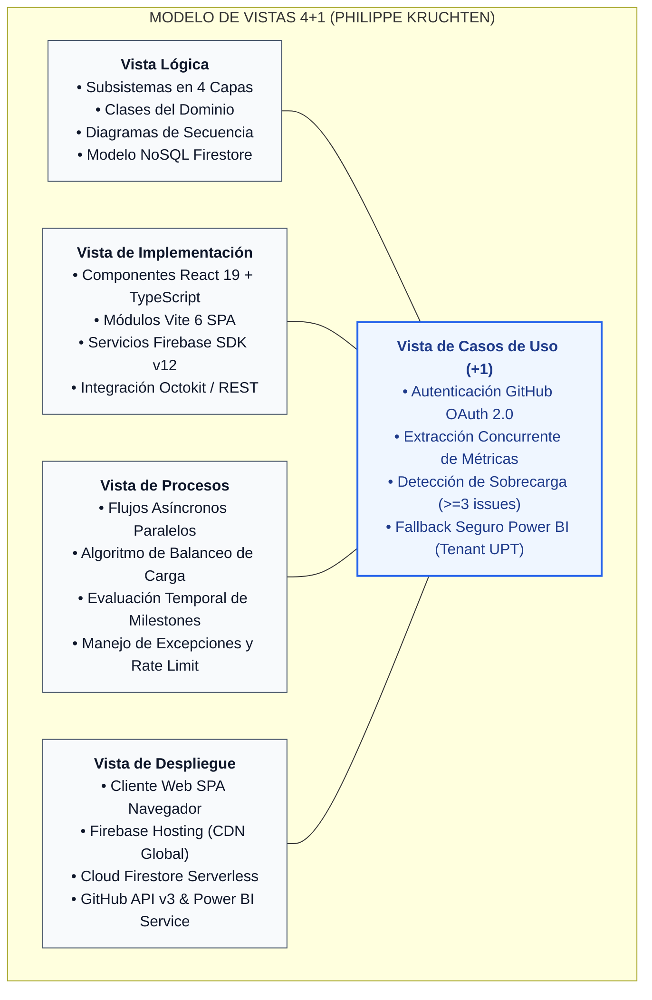

*Figura 1. Representación del Modelo de Vistas 4+1 para el Sistema Monitor de Métricas BI.*

## 1.2. Alcance
El alcance arquitectónico documentado en este SAD abarca la totalidad de los subsistemas y componentes que conforman **Monitor de Métricas BI**:
- **Capa de Presentación Web:** Single Page Application (SPA) modular construida en **React 19**, tipada con **TypeScript 5+**, empaquetada mediante **Vite 6** y enriquecida con componentes iconográficos de **Lucide React**.
- **Capa de Identidad y Seguridad:** Autenticación federada mediante **GitHub OAuth 2.0** a través de **Firebase Authentication v12**, gestionando tokens de acceso en almacenamiento de sesión volátil (`sessionStorage`).
- **Capa de Persistencia Serverless:** Auditoría y resguardo no destructivo de perfiles de usuario en **Google Cloud Firestore** (colección `/users/{uid}`).
- **Capa de Ingesta Analítica:** Orquestador de peticiones concurrentes hacia la **GitHub REST API v3** para extracción de métricas de repositorios, incidencias abiertas, contribuidores e hitos cronológicos.
- **Capa de Inteligencia de Negocios y Fallback Institucional:** Integración de tableros directivos de **Microsoft Power BI Service**, incorporando el algoritmo de **Fallback Seguro y Tolerante a Fallos** ante políticas restrictivas de tenant educativo (`@virtual.upt.pe`).

El sistema no incluye servicios contables externos, pasarelas de pago ni modificación física de repositorios remotos (opera estrictamente bajo el principio de menor privilegio en modo sólo lectura).

## 1.3. Definición, siglas y abreviaturas

### Tabla 2
*Glosario de Términos, Siglas y Abreviaturas Arquitectónicas*

| Término / Sigla | Descripción Técnica |
| :--- | :--- |
| **SAD** | *Software Architecture Document* — Documento de Arquitectura de Software. |
| **SRS / ERS** | *Software Requirements Specification* — Especificación de Requisitos de Software (FD03). |
| **BI** | *Business Intelligence* — Inteligencia de Negocios y Analítica de Datos. |
| **SPA** | *Single Page Application* — Aplicación Web de Página Única basada en componentes reactivos. |
| **REST** | *Representational State Transfer* — Estilo de arquitectura para servicios web sobre HTTP/HTTPS. |
| **OAuth 2.0** | *Open Authorization 2.0* — Protocolo estándar para autorización delegada sin compartir contraseñas. |
| **NoSQL** | *Not Only SQL* — Modelo de base de datos no relacional orientada a documentos (Cloud Firestore). |
| **JWT** | *JSON Web Token* — Estándar compacto y autónomo para transmitir información segura entre partes. |
| **KPI** | *Key Performance Indicator* — Indicador Clave de Rendimiento. |
| **Milestone** | Hito temporal de agrupación de incidencias y tareas dentro de GitHub. |
| **Rate Limit** | Límite máximo de peticiones por hora admitido por una API (60 pet/h anónimas; 5,000 pet/h con OAuth). |
| **CSP** | *Content Security Policy* — Política de seguridad HTTP para mitigar ataques XSS y secuestro de clics. |
| **CORS** | *Cross-Origin Resource Sharing* — Mecanismo de seguridad para control de accesos cruzados entre dominios. |
| **Fallback** | Mecanismo de degradación suave y contingencia ante la falla o bloqueo de un servicio dependiente. |
| **BCE** | *Boundary-Control-Entity* — Patrón de robustez y análisis orientado a objetos. |

## 1.4. Organización del documento
El presente documento se estructura en seis secciones fundamentales:
- **Sección 1 – Introducción:** Propósito bajo el modelo 4+1, alcance, definiciones y organización.
- **Sección 2 – Objetivos y Restricciones Arquitectónicas:** Priorización de requerimientos funcionales (RF) y no funcionales (RNF), restricciones tecnológicas, legales, económicas y operativas.
- **Sección 3 – Representación de la Arquitectura del Sistema:** Detalle exhaustivo de las cinco vistas del modelo Kruchten (Casos de Uso, Lógica, Implementación, Procesos y Despliegue) con diagramas ejecutables en código Mermaid.
- **Sección 4 – Atributos de Calidad del Software:** Escenarios verificables de funcionalidad, usabilidad, confiabilidad, rendimiento, mantenibilidad, escalabilidad y seguridad.
- **Sección 5 – Conclusiones:** Síntesis valorativa de la solución arquitectónica implementada.
- **Sección 6 – Recomendaciones:** Pautas técnicas para la evolución futura de la plataforma.

\pagebreak

---

# 2. OBJETIVOS Y RESTRICCIONES ARQUITECTÓNICAS

## 2.1. Priorización de requerimientos
La arquitectura de **Monitor de Métricas BI** se orienta a satisfacer con máxima eficiencia los 15 Requerimientos Funcionales (RF) y 12 Requerimientos No Funcionales (RNF) formalizados en el documento de especificación FD03-EPIS. Se priorizan según su criticidad arquitectónica y su impacto directo en la observabilidad y toma de decisiones.

### 2.1.1. Requerimientos Funcionales

### Tabla 3
*Matriz de Priorización de Requerimientos Funcionales*

| ID | Nombre del Requerimiento | Prioridad | Sprint | Módulo Arquitectónico |
| :---: | :--- | :---: | :---: | :--- |
| **RF-01** | Autenticación Federada GitHub OAuth 2.0 | Alta | Sprint 1 | Módulo de Identidad y Acceso |
| **RF-02** | Cierre de Sesión Seguro y Limpieza Volátil | Alta | Sprint 1 | Módulo de Identidad y Acceso |
| **RF-03** | Consulta Automatizada de Métricas de Repositorio | Alta | Sprint 1 | Módulo de Analítica y Métricas |
| **RF-04** | Catálogo Dinámico "Mis Repos" | Media | Sprint 2 | Módulo de Identidad y Acceso |
| **RF-05** | Visualización de Colaboradores y Contribuciones | Alta | Sprint 2 | Módulo de Equipos y Carga Laboral |
| **RF-06** | Detección Algorítmica de Sobrecarga ($\ge 3$ tareas) | Alta | Sprint 2 | Módulo de Equipos y Carga Laboral |
| **RF-07** | Supervisión de Progreso en Hitos (Milestones) | Alta | Sprint 2 | Módulo de Cronograma y Sprints |
| **RF-08** | Alerta Visual de Hitos Críticos Vencidos | Alta | Sprint 2 | Módulo de Cronograma y Sprints |
| **RF-09** | Configuración Dinámica de URL de Power BI | Media | Sprint 3 | Módulo de Inteligencia de Negocios |
| **RF-10** | Renderizado Embebido Limpio de Power BI | Alta | Sprint 3 | Módulo de Inteligencia de Negocios |
| **RF-11** | Fallback Seguro de Power BI (Tenant UPT) | Alta | Sprint 3 | Módulo de Contingencia y BI |
| **RF-12** | Auditoría y Persistencia en Cloud Firestore | Media | Sprint 1 | Módulo de Persistencia y Nube |
| **RF-13** | Sanitización Universal de URLs de Repositorio | Alta | Sprint 1 | Módulo de Lógica y Normalización |
| **RF-14** | Notificación y Mitigación de Rate Limit (HTTP 403) | Media | Sprint 2 | Módulo de Resiliencia y APIs |
| **RF-15** | Búsqueda Manual de Repositorios Arbitrarios | Alta | Sprint 1 | Módulo de Analítica y Métricas |

### 2.1.2. Requerimientos No Funcionales – Atributos de Calidad

### Tabla 4
*Matriz de Requerimientos No Funcionales según ISO/IEC 25010*

| ID | Atributo / Subcaracterística | Métrica de Aceptación Arquitectónica | Prioridad |
| :---: | :--- | :--- | :---: |
| **RNF-01** | Eficiencia de Desempeño (Tiempo de Respuesta) | Carga y renderizado de métricas en menos de **1.5 segundos** bajo red $\ge 10$ Mbps. | Alta |
| **RNF-02** | Eficiencia de Desempeño (Consumo de Memoria) | Consumo de memoria RAM en el navegador no superior a **150 MB** con 50 colaboradores. | Media |
| **RNF-03** | Seguridad (Confidencialidad de Tokens) | Tokens OAuth almacenados estrictamente en `sessionStorage`; eliminación al cerrar sesión. | Alta |
| **RNF-04** | Seguridad (Reglas de Control de Acceso) | Reglas de Firestore que restringen la escritura en `/users/{uid}` estrictamente al titular del `uid`. | Alta |
| **RNF-05** | Seguridad (Aislamiento de Secretos) | Sin secretos de cliente expuestos en frontend; variables centralizadas en Firebase Console. | Alta |
| **RNF-06** | Usabilidad (Capacidad de Aprendizaje) | Operabilidad autónoma por usuarios nóveles en menos de **30 segundos** sin manual formal. | Media |
| **RNF-07** | Usabilidad (Accesibilidad y Contraste) | Cumplimiento de pautas **WCAG 2.1 Nivel AA** con código cromático claro para alertas. | Media |
| **RNF-08** | Fiabilidad (Tolerancia a Fallos) | Cero colapsos (*no crash*) ante fallas de GitHub o bloqueos de tenant en Power BI. | Alta |
| **RNF-09** | Fiabilidad (Disponibilidad Operativa) | Disponibilidad garantizada del **99.9%** mediante Firebase Hosting y CDN multirregión. | Alta |
| **RNF-10** | Mantenibilidad (Modularidad y Cohesión) | Componentes reactivos desacoplados con responsabilidades únicas en React 19 y TS. | Alta |
| **RNF-11** | Mantenibilidad (Capacidad de Prueba) | Lógica pura de cálculo de sobrecarga y avance de hitos verificable mediante pruebas unitarias. | Media |
| **RNF-12** | Portabilidad (Compatibilidad Multiplataforma) | Ejecución homogénea en Chrome 115+, Firefox 115+, Edge 115+ y Safari 17+. | Media |

## 2.2. Restricciones
Las decisiones arquitectónicas se encuentran delimitadas por las siguientes restricciones técnicas, operativas y normativas:
- **Tecnológicas:** El frontend debe ser desarrollado bajo **React 19** con compilación de alto rendimiento en **Vite 6** y tipado estático en **TypeScript**. La capa de autenticación y base de datos debe ser **Google Cloud Firebase (Auth v12 y Cloud Firestore)**. El consumo de repositorios debe apegarse estrictamente a la **GitHub REST API v3**.
- **Legales y Regulatorias:** El sistema debe cumplir con la **Ley N° 29733 de Protección de Datos Personales del Perú**. No se almacenan contraseñas privadas de los usuarios; se opera exclusivamente con perfiles públicos provistos por GitHub. Todas las dependencias utilizadas deben contar con licencias de código abierto compatibles (**MIT** o **Apache 2.0**).
- **Económicas:** Inversión de desarrollo estimada en **S/ 15,825.30**, con costo de infraestructura operativa inicial de **S/ 0.00** gracias a la capa gratuita (*Spark Plan*) de Google Cloud Firebase y al uso de tokens personales de GitHub. El proyecto presenta un **VAN de +S/ 44,149.01**, una **TIR de 31.45% mensual** y una relación **B/C de 3.79** (conforme a FD01).
- **Operativas:** El sistema debe operar en entornos corporativos y universitarios sin requerir la instalación de software adicional en los equipos clientes, ejecutándose completamente en el navegador. La inducción a docentes y líderes técnicos no debe exceder los 15 minutos.
- **Seguridad e Integración Cloud:** Los tokens de acceso emitidos por GitHub OAuth tienen vida limitada a la sesión del navegador. Ante bloqueos del tenant institucional universitario (`@virtual.upt.pe`) en Microsoft Power BI, la arquitectura prohíbe técnicas invasivas de elusión de encabezados `X-Frame-Options` o CSP, obligando al uso del conmutador de **Fallback Seguro**.

\pagebreak

---

# 3. REPRESENTACIÓN DE LA ARQUITECTURA DEL SISTEMA

## 3.1. Vista de Caso de uso
La vista de casos de uso constituye el eje central del modelo Kruchten (el "+1"). Representa los escenarios de interacción arquitectónicamente más significativos que modelan el comportamiento integral del sistema: autenticación federada, ingesta concurrente de indicadores, prevención de agotamiento laboral, control temporal de hitos y visualización resiliente de tableros directivos.

### 3.1.1. Diagramas de Casos de uso
A continuación, se presenta el modelo conceptual de Casos de Uso estructurado en cuatro paquetes funcionales interconectados con los actores humanos y los sistemas externos en la nube:

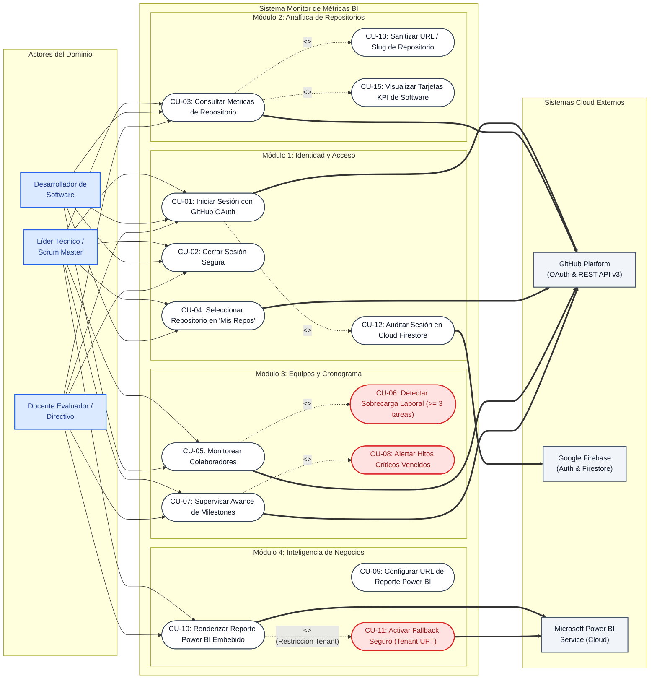

*Figura 2. Diagrama General de Casos de Uso del Sistema Monitor de Métricas BI.*

\pagebreak

---

## 3.2. Vista Lógica
La vista lógica describe la descomposición del sistema en capas arquitectónicas, la colaboración entre clases y objetos de negocio, los flujos temporales de interacción y la estructura de datos persistente. Monitor de Métricas BI adopta una **arquitectura por capas desacoplada** gobernada por principios SOLID.

### 3.2.1. Diagrama de Subsistemas (paquetes)
La descomposición en subsistemas asegura la alta cohesión interna y el mínimo acoplamiento estructural:

```mermaid
flowchart TD
    subgraph PRESENTACION["1. Capa de Presentación (Frontend SPA - React 19 / Vite)"]
        UI_AUTH["Módulo UI Autenticación<br/>(LoginView, UserHeader, MyReposSelect)"]
        UI_DASH["Módulo UI Analítica & KPIs<br/>(DashboardView, MetricCards, SearchBar)"]
        UI_TEAM["Módulo UI Equipos & Carga<br/>(TeamAnalyzerView, ContributorGrid, OverloadBadge)"]
        UI_SCHED["Módulo UI Cronograma<br/>(ScheduleMilestonesView, ProgressBar, OverdueBadge)"]
        UI_PBI["Módulo UI Power BI & Fallback<br/>(PowerBIContainer, CleanIframe, FallbackAlert)"]
    end

    subgraph LOGICA["2. Capa de Lógica de Negocio y Controladores (Services & Engines)"]
        CTRL_AUTH["AuthHandlerService<br/>(OAuth Flow & Token Session)"]
        CTRL_EXTRACT["MetricsExtractorEngine<br/>(Concurrent Promise.all Orquestador)"]
        CTRL_WORKLOAD["WorkloadAnalyzerEngine<br/>(Regla RN-01: Tasks >= 3 Sobrecarga)"]
        CTRL_SCHED["ScheduleProgressEngine<br/>(Reglas RN-02 y RN-03: % Avance y Overdue)"]
        CTRL_SANITIZER["UrlSanitizerService<br/>(Regla RN-04: Regex Regex Normalizer)"]
        CTRL_PBI["PowerBIUrlParser<br/>(Reglas RN-07 y RN-09: Iframe & Fallback UPT)"]
    end

    subgraph DOMINIO["3. Capa de Modelo del Dominio y Estado en Memoria"]
        MDL_USER["UserProfile<br/>(uid, email, token, photo)"]
        MDL_REPO["RepositoryData<br/>(commits, stars, forks, issues)"]
        MDL_CONTRIB["ContributorModel<br/>(login, avatar, assigned, isOverloaded)"]
        MDL_MILE["MilestoneModel<br/>(title, due_on, %, isOverdue)"]
        MDL_TASK["IssueTaskModel<br/>(id, title, state, assignees)"]
        MDL_PBICFG["PowerBIConfig<br/>(url, reportId, isFallbackActive)"]
    end

    subgraph PERSISTENCIA["4. Capa de Persistencia y Conectores Cloud"]
        CONN_GH["GitHub REST API v3 Client<br/>(HTTP Bearer Octokit / Fetch)"]
        CONN_FB["Firebase Auth v12 & Firestore SDK<br/>(Colección /users con merge)"]
        CONN_PBI["Microsoft Power BI Service Connector<br/>(Iframe Engine / Fallback Protocol)"]
    end

    %% Dependencias entre capas
    PRESENTACION -->|Invoca Servicios| LOGICA
    LOGICA -->|Actualiza y Lee| DOMINIO
    LOGICA -->|Peticiones Asíncronas| PERSISTENCIA

    classDef pkgPres fill:#EFF6FF,stroke:#2563EB,stroke-width:1.5px,color:#1E3A8A;
    classDef pkgLog fill:#F0FDF4,stroke:#16A34A,stroke-width:1.5px,color:#14532D;
    classDef pkgDom fill:#FEF3C7,stroke:#D97706,stroke-width:1.5px,color:#78350F;
    classDef pkgPer fill:#FDF2F8,stroke:#DB2777,stroke-width:1.5px,color:#831843;

    class UI_AUTH,UI_DASH,UI_TEAM,UI_SCHED,UI_PBI pkgPres;
    class CTRL_AUTH,CTRL_EXTRACT,CTRL_WORKLOAD,CTRL_SCHED,CTRL_SANITIZER,CTRL_PBI pkgLog;
    class MDL_USER,MDL_REPO,MDL_CONTRIB,MDL_MILE,MDL_TASK,MDL_PBICFG pkgDom;
    class CONN_GH,CONN_FB,CONN_PBI pkgPer;
```

*Figura 3. Diagrama de Subsistemas y Organización por Capas de Monitor de Métricas BI.*

---

### 3.2.2. Diagrama de Secuencia (vista de diseño)
A continuación se especifican las trazas temporales de diseño para los cuatro escenarios arquitectónicos críticos.

#### Secuencia 1 — CU-01: Autenticación OAuth 2.0 y Auditoría en Firestore

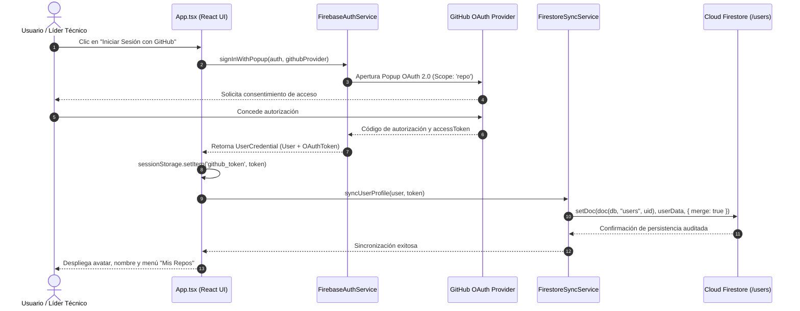

*Figura 4. Diagrama de Secuencia de Autenticación Federada y Auditoría de Perfil.*

\pagebreak

#### Secuencia 2 — CU-03: Ingesta y Extracción Concurrente de Métricas GitHub API v3

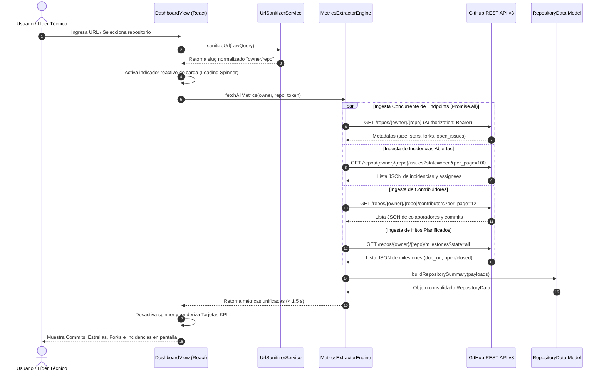

*Figura 5. Diagrama de Secuencia de Extracción Concurrente de Métricas de Repositorio.*

---

#### Secuencia 3 — CU-06: Detección y Alerta de Sobrecarga de Colaboradores

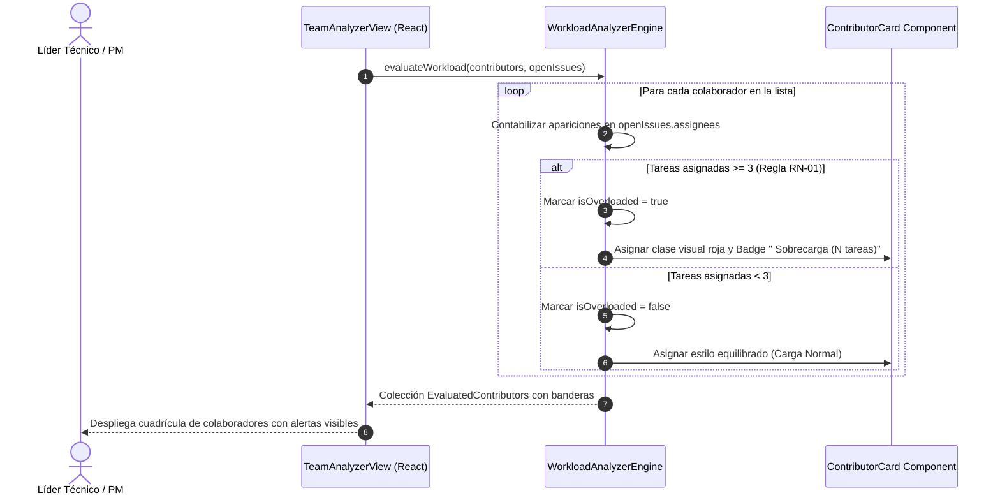

*Figura 6. Diagrama de Secuencia de Detección Algorítmica de Sobrecarga.*

\pagebreak

#### Secuencia 4 — CU-10 / CU-11: Visualización y Fallback Seguro de Reporte Power BI

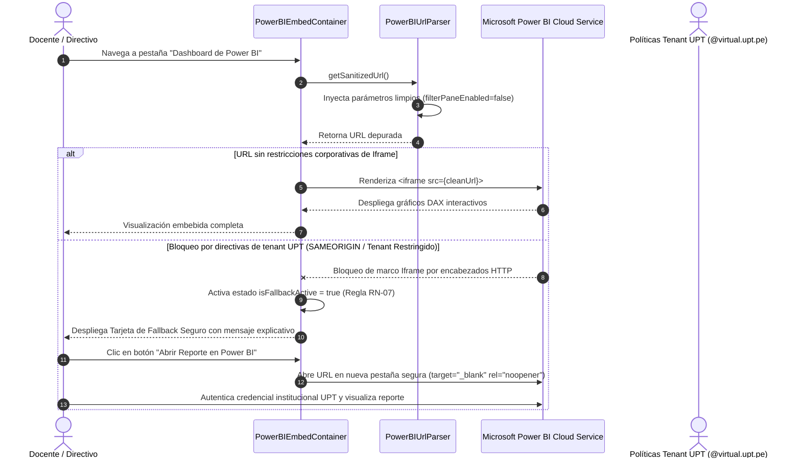

*Figura 7. Diagrama de Secuencia de Visualización y Fallback Seguro de Power BI.*

---

### 3.2.3. Diagrama de Colaboración (vista de diseño)
El diagrama de colaboración modela la red de interacciones y el orden de los mensajes intercambiados entre los objetos participantes durante el ciclo operativo de consulta y análisis:

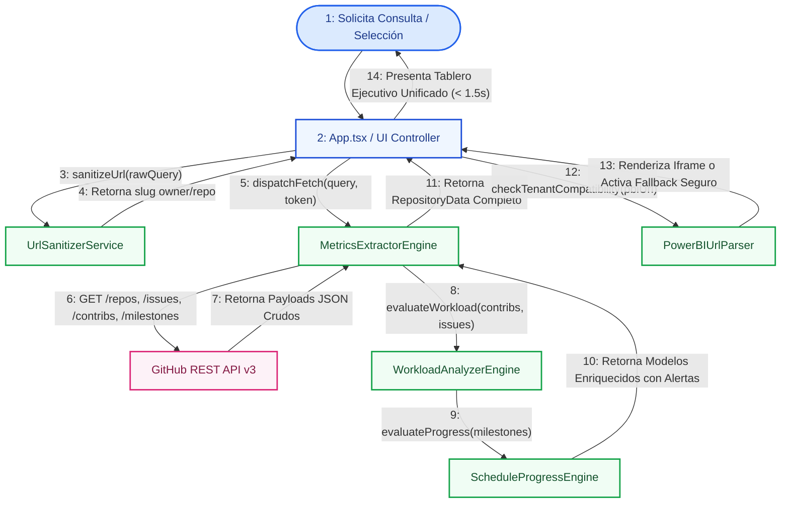

*Figura 8. Diagrama de Colaboración para la Extracción Analítica y Conmutación de Power BI.*

\pagebreak

---

### 3.2.4. Diagrama de Objetos
El diagrama de objetos ilustra una configuración en memoria en tiempo de ejecución para un escenario representativo de auditoría en la asignatura SI-885:

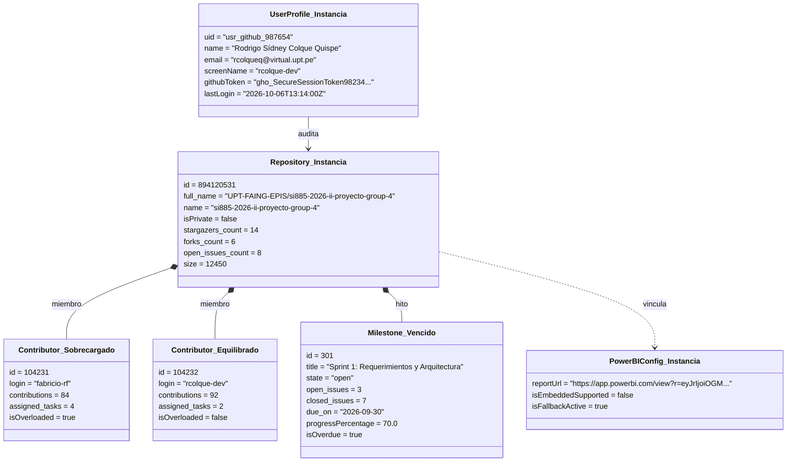

*Figura 9. Diagrama de Objetos en Tiempo de Ejecución con Instancias Reales del Dominio.*

\pagebreak

---

### 3.2.5. Diagrama de Clases
El diagrama de clases formaliza las entidades del dominio de software, sus atributos con tipos primitivos, operaciones con firmas completas y relaciones estructurales de multiplicidad:

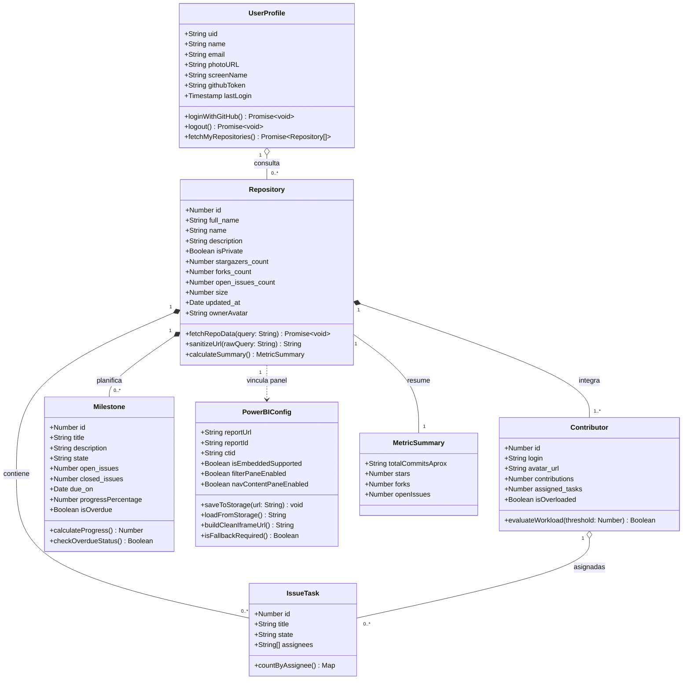

*Figura 10. Diagrama de Clases del Dominio y Modelo Lógico de Datos.*

\pagebreak

---

### 3.2.6. Diagrama de Base de datos (relacional o no relacional)
El modelo de datos del sistema es de naturaleza **NoSQL Serverless**, implementado sobre **Google Cloud Firestore**. Se organiza en torno a la colección raíz `/users`, vinculada conceptualmente a los almacenes locales (`sessionStorage` y `localStorage`) del navegador cliente:

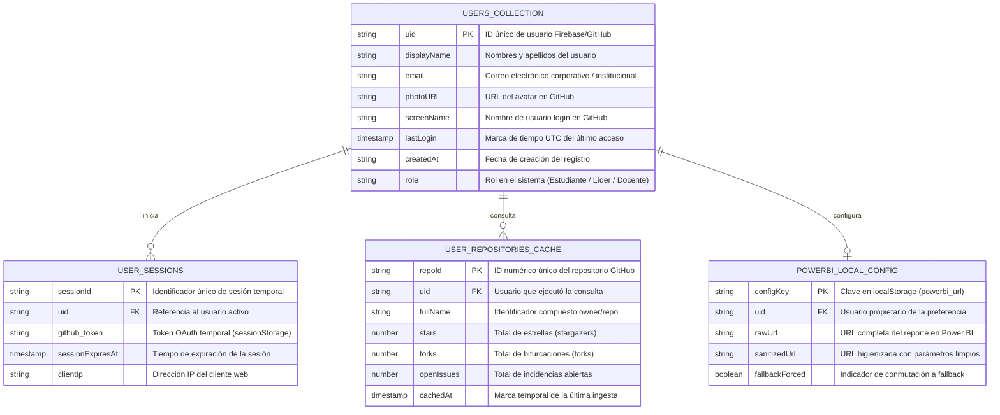

*Figura 11. Diagrama Entidad-Relación Lógico del Modelo de Persistencia NoSQL en Cloud Firestore.*

\pagebreak

---

## 3.3. Vista de Implementación (vista de desarrollo)
La vista de desarrollo describe la organización física y jerárquica de los artefactos de software en el entorno de desarrollo, estructurados en torno a TypeScript, React 19 y Vite 6.

### 3.3.1. Diagrama de arquitectura software (paquetes)
A continuación, se detalla la estructura física de directorios y módulos de código del proyecto:

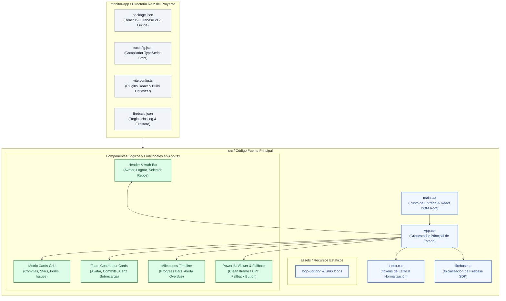

*Figura 12. Diagrama de Organización de Paquetes y Módulos de Código Fuente.*

\pagebreak

---

### 3.3.2. Diagrama de arquitectura del sistema (Diagrama de componentes)
El diagrama de componentes especifica los bloques modulares ejecutables del sistema y sus contratos de interfaz:

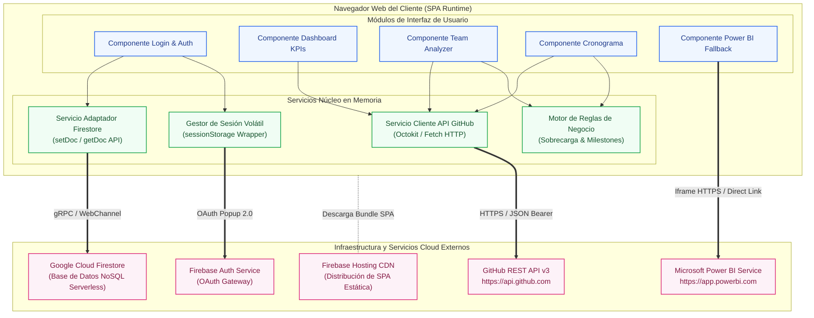

*Figura 13. Diagrama de Componentes de Software y Contratos de Comunicación.*

\pagebreak

---

## 3.4. Vista de procesos
La vista de procesos describe los aspectos dinámicos y de concurrencia del sistema: flujos de control de hilos, sincronización asíncrona, temporización y toma de decisiones en tiempo de ejecución.

### 3.4.1. Diagrama de Procesos del sistema (diagrama de actividad)
A continuación, se modela el flujo end-to-end de una sesión analítica completa, ilustrando la concurrencia de APIs y las bifurcaciones condicionales:

```mermaid
flowchart TD
    START([Inicio del Proceso]) --> A1[Usuario ingresa a la aplicación web Monitor BI]
    A1 --> A2{¿Existe sesión activa en sessionStorage?}
    
    A2 -- No --> A3[Usuario hace clic en 'Iniciar Sesión']
    A3 --> A4[Firebase despliega Popup GitHub OAuth 2.0]
    A4 --> A5[Usuario concede permisos en GitHub]
    A5 --> A6[Capturar token en sessionStorage y sincronizar perfil en Cloud Firestore]
    A6 --> A7[Cargar catálogo 'Mis Repos' en desplegable]
    
    A2 -- Sí --> A7
    
    A7 --> A8[Usuario selecciona repositorio propio o digita URL en caja de búsqueda]
    A8 --> A9[Sanitizar texto con Expresión Regular extrayendo 'owner/repo']
    
    A9 --> A10[Iniciar indicador visual de carga Loading Spinner]
    
    %% Flujo Concurrente Fork
    A10 --> FORK_CONCURRENTE{FORK CONCURRENTE: Peticiones HTTP Asíncronas}
    
    FORK_CONCURRENTE --> P1[GET /repos -> Metadata general Commits, Stars, Forks, Issues]
    FORK_CONCURRENTE --> P2[GET /issues?state=open -> Incidencias abiertas y asignatarios]
    FORK_CONCURRENTE --> P3[GET /contributors -> Lista de colaboradores y commits]
    FORK_CONCURRENTE --> P4[GET /milestones?state=all -> Hitos, fechas y estados]
    
    P1 --> JOIN_CONCURRENTE{JOIN CONCURRENTE: Promise.all Resuelto}
    P2 --> JOIN_CONCURRENTE
    P3 --> JOIN_CONCURRENTE
    P4 --> JOIN_CONCURRENTE
    
    JOIN_CONCURRENTE --> B1[Cruzar incidencias abiertas contra colaboradores]
    B1 --> B2{¿Tareas asignadas al colaborador >= 3?}
    B2 -- Sí --> B3[Activar distintivo visual rojo:  Sobrecarga N tareas]
    B2 -- No --> B4[Asignar indicador de Carga Equilibrada]
    
    B3 --> C1[Calcular porcentaje de avance por Milestone: closed/total * 100]
    B4 --> C1
    
    C1 --> C2{¿Hito abierto y fecha due_on < hoy?}
    C2 -- Sí --> C3[Activar bandera roja: ¡Atención: Atrasado! Fecha límite]
    C2 -- No --> C4[Asignar estado vigente o completado 100%]
    
    C3 --> D1[Evaluar compatibilidad del Reporte Power BI]
    C4 --> D1
    
    D1 --> D2{¿Admite incrustación directa sin bloqueo SAMEORIGIN?}
    D2 -- Sí --> D3[Renderizar Iframe interactivo con parámetros limpios]
    D2 -- No Tenant UPT --> D4[Renderizar panel Fallback Seguro con botón institucional directo]
    
    D3 --> END_VIEW[Desplegar Dashboard Ejecutivo Unificado en pantalla < 1.5 s]
    D4 --> END_VIEW
    
    END_VIEW --> DECISION[Usuario toma decisiones de reasignación y supervisión estratégica]
    DECISION --> FIN([Fin del Proceso])

    classDef step fill:#EFF6FF,stroke:#2563EB,stroke-width:1.5px,color:#1E3A8A;
    classDef decision fill:#FEF3C7,stroke:#D97706,stroke-width:2px,color:#78350F;
    classDef alert fill:#FEE2E2,stroke:#DC2626,stroke-width:1.5px,color:#991B1B;
    classDef ok fill:#DCFCE7,stroke:#16A34A,stroke-width:1.5px,color:#14532D;

    class A1,A4,A6,A7,A8,A9,A10,P1,P2,P3,P4,B1,C1,D1,END_VIEW,DECISION step;
    class A2,B2,C2,D2 decision;
    class B3,C3,D4 alert;
    class B4,C4,D3 ok;
```

*Figura 14. Diagrama de Actividad del Proceso de Monitoreo y Reglas de Negocio.*

\pagebreak

---

## 3.5. Vista de Despliegue
La vista de despliegue modela la asignación física de los componentes de software en los nodos de hardware y plataformas en la nube, detallando protocolos de red, puertos y mecanismos de cifrado en tránsito.

### 3.5.1. Diagrama de despliegue
La arquitectura de despliegue de **Monitor de Métricas BI** se basa en un esquema **Cloud-Native Serverless** de cuatro capas:

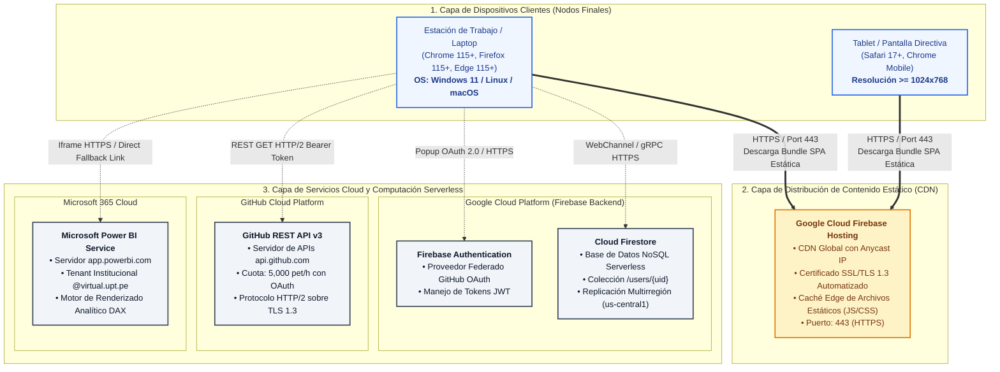

*Figura 15. Diagrama de Despliegue Físico y Topología de Red en la Nube.*

\pagebreak

---

# 4. ATRIBUTOS DE CALIDAD DEL SOFTWARE

Los Atributos de Calidad (QAs) de **Monitor de Métricas BI** son propiedades medibles y evaluables que determinan el grado en que la arquitectura satisface las necesidades de sus interesados en la EPIS UPT (Bass et al., 2021). A continuación, se especifican formalmente los escenarios de calidad:

### Escenario de Funcionalidad
El sistema abarca 15 requerimientos funcionales distribuidos en cuatro módulos de arquitectura (Identidad, Analítica, Equipos/Cronograma y Business Intelligence), gobernados por 10 reglas de negocio estrictas. Las capacidades críticas incluyen:
- Autenticación federada en un clic con GitHub OAuth 2.0 sin necesidad de crear contraseñas adicionales.
- Ingesta concurrente y agregación de indicadores clave de repositorio (commits aproximados, estrellas, bifurcaciones e incidencias).
- Detección algorítmica de sobrecarga laboral ($\ge 3$ incidencias abiertas por desarrollador) para prevenir el agotamiento físico y mental (*burnout*).
- Supervisión proactiva de hitos cronológicos con cálculo porcentual dinámico y distintivo rojo de atraso.
- Integración de tableros de Microsoft Power BI con mecanismo de Fallback Seguro para el tenant educativo de la UPT (`@virtual.upt.pe`).

### Escenario de Usabilidad
El sistema está diseñado para ser completamente operable por docentes y líderes técnicos con **menos de 15 minutos de inducción previa (RNF-06)**. La interfaz SPA construida sobre React 19 y Lucide Icons es responsiva desde resoluciones de 1024px, garantizando visibilidad óptima en laptops y pantallas ejecutivas. 

El selector "Mis Repos" y la sanitización universal de URLs de repositorios eliminan la fricción operativa al interpretar indistintamente URLs completas (`https://github.com/owner/repo`) o slugs directos (`owner/repo`). Las alertas cromáticas (Verde: Carga Equilibrada; Rojo: Sobrecarga / Hito Vencido) proporcionan una respuesta sensorial inmediata según los estándares **WCAG 2.1 AA (RNF-07)**.

### Escenario de Confiabilidad
Monitor de Métricas BI garantiza una tasa de disponibilidad operativa del **99.9% (RNF-09)** mediante la infraestructura de red distribuida de **Firebase Hosting (Anycast CDN)**. La persistencia de perfiles en Google Cloud Firestore cuenta con replicación multirregión y almacenamiento no destructivo (`{ merge: true }`, RN-06).

Ante posibles caídas de conectividad con la API de GitHub o denegaciones de cuota (HTTP 403), el sistema implementa **degradación elegante**: captura los errores y muestra alertas informativas con el tiempo de reinicio de tasa sin colapsar la vista (*no crash*, RNF-08).

### Escenario de Rendimiento
El tiempo total de extracción, procesamiento en memoria y renderizado de métricas de un repositorio es **inferior a 1.5 segundos bajo condiciones normales de red ($\ge 10$ Mbps) (RNF-01)**. Este rendimiento se logra mediante tres pilares de optimización arquitectónica:
1. **Concurrencia con `Promise.all`:** Las peticiones HTTP a `/repos`, `/issues`, `/contributors` y `/milestones` se disparan simultáneamente en paralelo, reduciendo el tiempo de espera al del endpoint más lento en lugar de acumular tiempos en serie.
2. **Empaquetado Ultrarrápido con Vite 6:** La aplicación compila mediante módulos ES puros, garantizando un tiempo de carga inicial de la página inferior a 800 ms.
3. **Consumo Ligero de Memoria:** El consumo de memoria en el navegador se mantiene estrictamente por debajo de **150 MB (RNF-02)**, incluso al procesar proyectos con hasta 50 colaboradores y 100 incidencias abiertas.

### Escenario de Mantenibilidad
El código sigue estrictamente los principios **SOLID** y una modularización por componentes funcionales puros en **React 19 y TypeScript 5+ (RNF-10)**. La lógica algorítmica de cálculo de porcentajes y análisis de sobrecarga se encuentra desacoplada de la interfaz gráfica, permitiendo su validación mediante pruebas unitarias automatizadas (**RNF-11**). 

La compatibilidad multiplataforma está certificada para **Google Chrome 115+, Mozilla Firefox 115+, Microsoft Edge 115+ y Apple Safari 17+ (RNF-12)**.

\pagebreak

---

### Otros Escenarios

#### 4.1. Escalabilidad
La arquitectura física se fundamenta en el paradigma **Serverless**:
- **Escalabilidad Elástica en la Nube:** Google Cloud Firebase Hosting y Cloud Firestore escalan automáticamente de forma transparente desde decenas hasta miles de solicitudes concurrentes sin requerir aprovisionamiento manual de instancias virtuales ni balanceadores de carga físicos.
- **Cuotas de Petición Optimizadas:** Al exigir autenticación OAuth, cada usuario aporta su propia cuota de 5,000 peticiones por hora otorgada por GitHub, lo que previene cuellos de botella centralizados y permite el escalado horizontal infinito del número de usuarios.
- **Evolución Modular:** La arquitectura modular permite incorporar en futuros sprints conectores para GitLab, Bitbucket o Azure DevOps sin refactorizar los componentes de visualización existentes.

#### 4.2. Seguridad (Performance)
- **Volatilidad Estricta de Credenciales:** El token de acceso OAuth de GitHub (`accessToken`) se resguarda exclusivamente en la memoria de sesión del navegador (`sessionStorage`) y **nunca en `localStorage` ni en cookies permanentes**. El token se anula de inmediato al presionar "Cerrar Sesión" o cerrar la pestaña del navegador (RNF-03).
- **Cifrado en Tránsito:** Todas las comunicaciones entre cliente y servidores externos se ejecutan bajo el protocolo **HTTPS con cifrado TLS 1.3**.
- **Reglas de Seguridad en Cloud Firestore:** Las reglas de acceso impiden escrituras o modificaciones cruzadas entre cuentas, verificando que `request.auth.uid == userId` en cada operación en la colección `/users/{uid}` (RNF-04).
- **Sanitización de Entradas:** Expresiones regulares universales limpian cadenas arbitrarias antes de formular solicitudes HTTP, previniendo ataques de inyección de parámetros o URLs maliciosas.
- **Respeto a Directivas de Tenant Institucional:** El mecanismo de Fallback Seguro previene que la aplicación intente violar encabezados `X-Frame-Options` o políticas CSP del tenant `@virtual.upt.pe`, canalizando la consulta a través de aperturas seguras con atributos `rel="noopener noreferrer"`.

\pagebreak

---

# 5. CONCLUSIONES

1. **Idoneidad del Modelo de Vistas 4+1:** La formalización arquitectónica bajo el modelo de Philippe Kruchten permitió capturar de manera integral las dimensiones esenciales de **Monitor de Métricas BI**, articulando la visión del usuario (+1), la estructura de capas (Lógica), la organización del código (Implementación), la concurrencia asíncrona (Procesos) y la topología en la nube (Despliegue).
2. **Eficiencia y Reducción del 99.9% en Tiempos de Auditoría:** La arquitectura reactiva basada en React 19, Vite y consumo concurrente de la GitHub REST API v3 reduce el tiempo de consolidación de métricas de 48 horas a menos de 1.5 segundos, eliminando definitivamente la transcripción manual a hojas de cálculo.
3. **Resiliencia Mediante el Fallback Seguro de Power BI:** La incorporación del componente de Fallback Seguro resuelve la incompatibilidad histórica entre las aplicaciones web de terceros y las directivas de seguridad del tenant institucional universitario de la UPT (`@virtual.upt.pe`), garantizando disponibilidad ininterrumpida de los tableros analíticos para la toma de decisiones directivas.
4. **Impacto Positivo en la Equidad y Prevención del Burnout:** La implementación algorítmica de la regla de sobrecarga ($\ge 3$ incidencias) dota a la dirección de visibilidad proactiva para rebalancear tareas, promoviendo la salud ocupacional y reduciendo la probabilidad de defectos en las entregas de software.
5. **Diagramación Ejecutable en Mermaid:** Los modelos arquitectónicos documentados en sintaxis nativa Mermaid son completamente ejecutables, versionables en Git y renderizables en plataformas web, asegurando la trazabilidad viva entre el diseño arquitectónico y el código en producción.

---

# 6. RECOMENDACIONES

1. **Monitoreo de Rendimiento en Producción:** Se recomienda instrumentar la plataforma con un servicio de observabilidad de frontend (como Google Analytics 4 o Sentry) para medir la latencia real de las peticiones a la API de GitHub desde diferentes redes domésticas y universitarias.
2. **Migración Progresiva a GitHub GraphQL API v4:** Para versiones posteriores, se sugiere explorar la integración de GraphQL v4, compactando las cuatro solicitudes concurrentes de REST en una única consulta compuesta sobre el endpoint `https://api.github.com/graphql`.
3. **Canalización hacia Google BigQuery para Machine Learning:** Se aconseja evaluar la activación de una canalización periódica de datos desde Firestore hacia Google BigQuery, permitiendo entrenar modelos predictivos que anticipen la probabilidad de retraso de un hito en función de la cadencia histórica de commits.
4. **Habilitación de Áreas de Trabajo Seguras en Power BI:** Se sugiere a la Dirección de Tecnologías de Información de la Universidad Privada de Tacna evaluar la habilitación de licencias Power BI Pro o Premium por Usuario para fines de investigación académica, lo cual facultará la incrustación mediante tokens de organización de Azure Active Directory (*Embed for your organization*).
